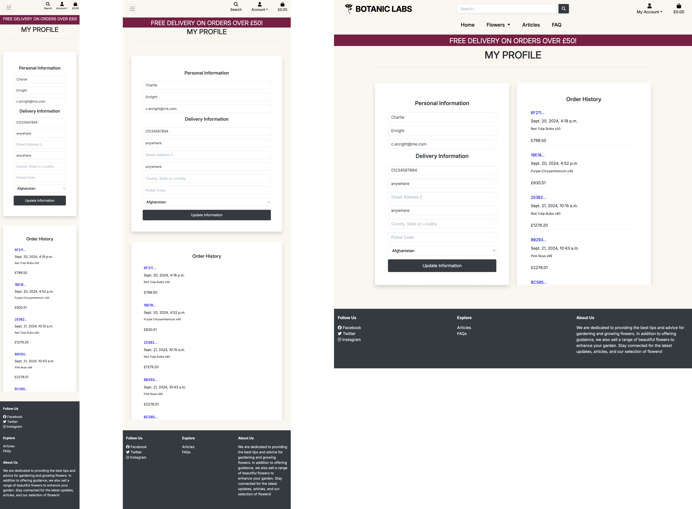

# BOTANIC LABS


# Table of Contents

1. [Introduction](#10-introduction)
2. [User Experience](#20-user-experience)
   - [Strategy](#21-strategy)
     - [Project Rationale](#211-project-rationale)
     - [Target Audience](#212-target-audience)
     - [Project Goals](#213-project-goals)
       - [Website Owner Goals](#website-owner-goals)
       - [External User Goals](#external-user-goals)
   - [User Stories](#214-user-stories)
3. [Scope](#30-scope)
   - [Key Feature Breakdown](#key-feature-breakdown)
4. [Structure](#40-structure)
   - [Frontend Framework](#41-frontend-framework)
   - [Database](#42-database)
   - [Database Schema](#43-database-schema)
   - [User Journey](#44-user-journey)
5. [Skeleton](#50-skeleton)
   - [Wireframes](#51-wireframes)
6. [Design](#60-design)
   - [Colour Scheme](#61-colour-scheme)
   - [Fonts](#fonts)
   - [Accessibility](#accessibility)
7. [Features](#70-features)
   - [Existing Features](#71-existing-features)
   - [Future Features](#72-future-features)
8. [Technology Used](#80-technology-used)
   - [Languages](#languages)
   - [Frameworks](#frameworks)
   - [Libraries](#libraries)
   - [Database](#database)
   - [Services](#services)
   - [Other Tools](#other-tools)
9. [Testing](#90-testing)
10. [Deployment](#100-deployment)
    - [Live Deployment](#live-deployment)
    - [Local Deployment](#local-deployment)
    - [Deployment to Heroku](#deployment-to-heroku)
    - [AWS Setup for Static and Media Files](#aws-setup-for-static-and-media-files)
    - [Stripe Payments Setup](#setting-up-stripe-payments)
    - [Emails Setup](#setting-up-emails-on-the-deployed-site)
    - [Heroku Config Variables](#heroku-config-variables)
11. [References](#110-references)
12. [Acknowledgements](#120-acknowledgements)

# 1.0  INTRODUCTION
Botanic Labs is a eCommerce flower website dedicated to helping people make the most of their garden space. Whether you're a seasoned gardener or a complete beginner, Botanic Labs offers a friendly interface to explore, purchase, and learn about a wide variety of plants. Our focus on seasonal blooms ensures that you can find the perfect plant for your garden, no matter the time of year.

You can view the deployed site [here](https://botanic-labs-d446513705ac.herokuapp.com/)

# 2.0  USER EXPERIENCE
## 2.1 Strategy
This section outlines the fundamental reasons behind the creation of **Botanic Labs** and how it aims to address specific needs within the gardening community. It delves into the rationale for the project, identifying the gaps and opportunities within existing platforms. This section also highlights the target audience, their goals, and the broader objectives of the website. By understanding these strategic elements, users can better appreciate the purpose and intended impact of **Botanic Labs**..

### 2.1.1 Project Rationale
While many gardening websites offer plants and gardening products, few provide a comprehensive, engaging platform that caters to both seasoned gardeners and beginners. Botanic Labs was conceived to fill this gap, offering an inspiring and interactive space where users can explore, purchase, and learn about plants tailored to their specific needs and garden spaces.

Botanic Labs aims to inspire customers to enhance their gardens by providing a wide range of plants suited for every season. The platform encourages user engagement through resources such as blogs and FAQs. These resources provide valuable advice and insights, creating a sense of shared enthusiasm and support among gardening enthusiasts.

The platform includes a search filter based on seasonality, which allows users to quickly locate plants suitable for particular times of the year. This feature streamlines the shopping experience, helping customers find plants that align with their gardening plans and seasonal needs.

Botanic Labs addresses several key needs:
  - Inspiring Purchase and Engagement: By offering a wide selection of plants along with informative content, Botanic Labs motivates users to explore and purchase plants while furthering their gardening knowledge. This approach not only enhances the shopping experience but also encourages users to engage with the platform regularly.
	- Educational Resources: The inclusion of articles and FAQs provides users with a robust knowledge base on gardening practices, plant care, and garden design. This information allows customers to make informed decisions, leading to healthier gardens and greater satisfaction with their purchases.
	- Personalised Shopping Experience: The seasonality filter enables users to find plants that align with specific seasonal requirements, making it easier to choose plants that will thrive in their gardens. This focus on personalisation ensures that users have a more relevant and satisfying shopping experience.

## 2.1.2 Target Audience
**Botanic Labs** is designed to attract a diverse range of customers who are looking for a fresh, contemporary take on garden products. With its trendy appeal and user-friendly platform, Botanic Labs caters to both beginners and advanced gardeners, making gardening accessible and enjoyable for everyone.

## 2.1.3 Project Goals
## Website Owner Goals
**Increase Sales and Revenue:**
The primary goal for Botanic Labs as a business is to increase sales of plants and gardening products. By offering a selection of high-quality, seasonal plants and providing a seamless shopping experience, the website aims to boost revenue through online sales.

**Build Brand Recognition and Loyalty:**
Botanic Labs seeks to establish itself as a trusted and recognised brand in the gardening market. By providing excellent customer service, quality products, and valuable content, the goal is to build strong brand loyalty and encourage repeat customers.

**Grow the User Base:**
Expanding the reach of Botanic Labs is crucial. The goal is to attract a growing number of users, both beginner and experienced gardeners.

**Enhance User Engagement:**
Increasing user engagement on the platform is a key objective. By providing new content in the form of articles and FAQs Botanic Labs aims to create a resource of all levels of gardeners.

**Expand Product Offerings:**
To meet the diverse needs of its customers, Botanic Labs aims to continually expand its range of products, including new plant varieties, gardening tools, and accessories. This will cater to different tastes and garden sizes, enhancing the overall shopping experience.

**Promote Sustainable Gardening Practices:**
Botanic Labs is committed to promoting environmentally friendly gardening practices. The goal is to educate customers about sustainable options through articles and offer products that align with these principles, contributing to a healthier environment.

## External User Goals
**Find the Right Plants for Their Garden:**
Users visit Botanic Labs with the goal of finding plants that suit their specific garden conditions and preferences. Whether they are looking for seasonal blooms, plants for a particular light exposure, or options for small urban spaces, the platform aims to provide tailored plant recommendations.

**Learn and Improve Gardening Skills:**
Many users, especially beginners, seek to learn more about gardening. Botanic Labs offers educational resources such as articles and FAQs to help users gain knowledge and improve their gardening skills, ensuring they can grow and maintain a beautiful garden.

**Access Quality Products Easily:**
Users expect a straightforward and convenient shopping experience. Botanic Labs aims to provide a user-friendly website where customers can easily browse, filter, and purchase high-quality plants and gardening products, ensuring a smooth and satisfying experience.

## 2.1.4 User Stories

| Role             | User Story Description                                                                                   |
|------------------|----------------------------------------------------------------------------------------------------------|
| **General Visitor**  | Understand the site’s purpose and services offered.                                                     |
|                  | Browse products without creating an account.                                                               |
|                  | Navigate easily through different product categories.                                                       |
|                  | Use a search function to find specific plants or products.                                                 |
|                  | Read gardening tips and advice on the blog.                                                                |
|                  | View product details, including planting instructions and care tips.                                        |
| **Shopper**         | Add products to the cart with real-time total cost updates.                                              |
|                  | Adjust quantities or remove items from the cart.                                                           |
|                  | View related products or companion plants for inspiration.                                                 |
|                  | Complete purchases as a guest without needing an account.                                                  |
|                  | Read product reviews from other gardeners.                                                                 |
|                  | Save cart contents for future reference.                                                                   |
| **Registered User**  | Easily create an account for personalised features.                                                     |
|                  | Log in and out securely to protect information.                                                            |
|                  | Reset password if forgotten to regain access.                                                              |
|                  | View order history for tracking purchases.                                                                 |
|                  | Save shipping and billing information for faster checkout.                                                 |
|                  | Create a wishlist for future purchases.                                                                    |
|                  | Leave reviews on purchased products to share experiences.                                                  |
|                  | Subscribe to the newsletter for updates on new products and gardening tips.                                |
| **Site Admin**      | Add, edit, or remove products to keep the catalog up-to-date.                                           |
|                  | Manage product categories and tags to help users find items easily.                                        |
|                  | Process and update orders to keep customers informed.                                                      |
|                  | Moderate user reviews to ensure content is appropriate and helpful.                                        |
|                  | Create and edit blog posts to share gardening tips and news.                                               |
|                  | View reports on sales and popular products for informed business decisions.                                |
|                  | Manage user accounts and permissions to provide the right access levels.                                   |

# 3.0   SCOPE
To ensure **Botanic Labs** is able to meet the needs of its audience a variety of features designed to enhance user experience, engagement and functionality have been considered. At a minimum the following features have been deemed essential to meet the needs of different types of users and ensure the website is comprehensive and user friendly.

| **Feature**                                                            | **Difficulty** | **Importance** |
|------------------------------------------------------------------------|----------------|----------------|
| Responsive Design                                                      | 1              | 5              |
| Database to store products                                             | 2              | 5              |
| Intuitive Navigation                                                   | 1              | 5              |
| User Authentication - Registration & Login                             | 4              | 5              |
| User Authentication - Password Reset                                   | 4              | 5              |
| Product Catalog - Browse by Category (Season)                                  | 2              | 5              |
| Product Catalog - Search Functionality                                 | 3              | 4              |
| Product Details - Detailed Information                                 | 2              | 5              |
| Shopping Cart - Add/Remove Items                                       | 4              | 5              |
| Shopping Cart - Update Quantities                                      | 4              | 5              |
| Shopping Cart - Save Cart for Registered Users                         | 3              | 4              |
| Checkout Process - Guest Checkout                                      | 3              | 5              |
| Checkout Process - Secure Payments with Stripe                         | 5              | 5              |
| Checkout Process - Address Management                                  | 4              | 4              |
| User Profile - Order History                                           | 3              | 4              |
| User Profile - Saved Addresses                                         | 4              | 4              |
| FAQ Page                                                               | 2              | 4              |
| Articles with gardening tips                                                               | 2              | 4              |
| Reviews                                                               | 2              | 3             |
| Wishlist                                                               | 2              | 2              |
| Advanced filtering                                  | 4              | 3              |
| Admin Panel - Manage Products & Categories                             | 3              | 5              |
| Admin Panel - Manage Orders                                            | 4              | 5              |
| Admin Panel - View Customer Reviews                                    | 3              | 3              |
| Contact Us Page                                                        | 2              | 3              |

## Key Feature Breakdown

### General:
- **Responsive Design:** Ensures usability across various devices, enhancing user experience. (Importance: 5)
- **Database to Store Products:** Enables efficient storage and retrieval of product information. (Importance: 5)
- **Intuitive Navigation:** Allows users to easily access different sections and features of the site. (Importance: 5)

### User Authentication:
- **Registration & Login:** Provides secure access to the site, allowing users to create and manage accounts. (Importance: 5)
- **Password Reset:** Helps users regain access if they forget their passwords, ensuring smooth account management. (Importance: 5)

### Product Catalogue:
- **Browse by Category (Season):** Helps users find plants suitable for specific seasons, enhancing browsing experience. (Importance: 5)
- **Search Functionality:** Allows users to quickly locate specific products, saving time. (Importance: 4)

### Product Details:
- **Detailed Information:** Comprehensive descriptions on planting and care enable informed purchasing. (Importance: 5)

### Shopping Cart & Checkout:
- **Add/Remove Items & Update Quantities:** Allows users to manage their cart contents easily. (Importance: 5)
- **Save Cart for Registered Users:** Enables users to save their selections for future visits. (Importance: 4)
- **Guest Checkout:** Provides a convenient option for non-registered users to complete purchases. (Importance: 5)
- **Secure Payments with Stripe:** Ensures safe transactions through trusted payment processing. (Importance: 5)
- **Address Management:** Allows registered users to save addresses for a streamlined checkout experience. (Importance: 4)

### User Profiles:
- **Order History:** Allows users to review past purchases, enhancing customer experience. (Importance: 4)
- **Saved Addresses:** Facilitates faster checkout for returning users by storing address information. (Importance: 4)

### Admin Panel:
- **Manage Products, Categories, and Orders:** Essential tools for maintaining an up-to-date product catalog and processing orders. (Importance: 5)
- **View Customer Reviews:** Allows admins to monitor user feedback and ensure content quality. (Importance: 3)

### Additional Features:
- **FAQ Page:** Provides quick answers to common questions, improving user support. (Importance: 4)
- **Articles with Gardening Tips:** Educates users, helping them improve their gardening skills. (Importance: 4)
- **Contact Us Page:** Enables users to reach out with inquiries or feedback, enhancing communication. (Importance: 3)
- **Reviews (Future Addition):** Allows users to leave feedback, helping build community trust. (Importance: 3)
- **Wishlist (Future Addition):** Enables users to save products for later, encouraging return visits. (Importance: 2)
- **Advanced Filtering:** Provides additional search options based on soil type and light exposure for precise results. (Importance: 3)

# 4.0   STRUCTURE
## 4.1 Frontend Framework
Botanic Labs is built using **Bootstrap v4.1**, ensuring a responsive and mobile-friendly design across all devices. 

## 4.2 Database
The backend application connects to a Postgres database hosted on [Amazon Web Service](https://aws.amazon.com/). Below is a summary of the models used on Botanic Labs. 

THe Code Institute **Boutique Ado** walkthrough provided a foundation for the models used in Botanic Labs, particularly for the Products, category, UserProfile, Order and OrderLineItem models. Botanic Labs also uses two original models (FAQs and Articles) created specfically for it. 

Since Botanic Labs is selling plant products the Product model was significanrly adapted to meet the specific needs of Botanic Labs.

Here are the key areas where Botanic Labs Product model diverges from Boutique Ado:
1. **Seasonality and Planting/Flowering Periods:**
  - In Botanlic Labs it was necessary to include planting and flowering periods for each product. This was achieved this by adding fields such as planting_start, planting_end, flowering_start, and flowering_end. These fields use integer choices (representing months), along with MinValueValidator and MaxValueValidator to ensure valid month selection (1-12).

  - It was setup this way so that users would be able to search for products by selecting specific planting or flowering months. For example, users could query products based on whether a specific month falls within these ranges. 
  In Hindsight a better approach would have been to use Djangos built-in DateField. This way it would be working with actual date ranges instead of abstract month numbers and simplified the code. 

  - A Season model was added which allows users to associate products with a specific season, as seasonality is important for plants.

2. **Soil Drainage, Lifespan, Type and Light Exposure:**
  - Key characteristcs were added with the intention of implemented more refined filters for product searching enaabling users to find products more suited to their needs. However, adding the filters on was beyond the scope of the current project but can be added later as the attributes are available. Each of these fields uses a choice system to allow users to select predefined options. For example, soil_drainage can be well_drained, poorly_drained, or moist, and lifespan can be annual, biennial, or perennial.

3. **Recomendations**
  - Botanic Labs uses three self-referencing foreign keys (recommendation_1, recommendation_2, and recommendation_3) to allow each product to recommend other related products. This feature offers additional upselling opportunities.

4. **Removed Size Handling**
	- The original walkthrough had a has_sizes field because it dealt with products like clothing. Since Botanic Labs  focuses on plants, this field wasn’t necessary and was omitted.

5. **Custom Methods**
  - Botanic Labs uses two custom methods, get_planting_period() and get_flowering_period(), which provide a user-friendly display of planting and flowering periods, using Django’s built-in get_FOO_display() functionality for choice fields. These methods help to display the product’s seasonal information on the front end.


**Botanic Labs' Models**
<details>
  <summary>Click to expand UserProfile</summary>

  | Field                    | Field Type      | Validation                | null  | blank | default | on_delete | editable |
  |--------------------------|-----------------|---------------------------|-------|-------|---------|-----------|----------|
  | user                     | OneToOneField   | n/a                       | FALSE | FALSE | n/a     | CASCADE   | TRUE     |
  | default_phone_number     | CharField       | max_length=20             | TRUE  | TRUE  | n/a     | n/a       | TRUE     |
  | default_street_address1  | CharField       | max_length=80             | TRUE  | TRUE  | n/a     | n/a       | TRUE     |
  | default_street_address2  | CharField       | max_length=80             | TRUE  | TRUE  | n/a     | n/a       | TRUE     |
  | default_town_or_city     | CharField       | max_length=40             | TRUE  | TRUE  | n/a     | n/a       | TRUE     |
  | default_county           | CharField       | max_length=80             | TRUE  | TRUE  | n/a     | n/a       | TRUE     |
  | default_postcode         | CharField       | max_length=20             | TRUE  | TRUE  | n/a     | n/a       | TRUE     |
  | default_country          | CountryField    | blank_label='Country'     | TRUE  | TRUE  | n/a     | n/a       | TRUE     |

</details>

<details>
  <summary>Click to expand Season Model table</summary>

  | Field          | Field Type   | Validation       | null  | blank | default | on_delete | editable |
  |----------------|--------------|------------------|-------|-------|---------|-----------|----------|
  | name           | CharField    | max_length=254   | FALSE | FALSE | n/a     | n/a       | TRUE     |
  | friendly_name  | CharField    | max_length=254   | TRUE  | TRUE  | n/a     | n/a       | TRUE     |

</details>

<details>
  <summary>Click to expand Product Model table</summary>

  | Field              | Field Type       | Validation                                                                 | null  | blank | default | on_delete | editable |
  |--------------------|------------------|----------------------------------------------------------------------------|-------|-------|---------|-----------|----------|
  | season             | ForeignKey       | n/a                                                                        | TRUE  | TRUE  | n/a     | SET_NULL  | TRUE     |
  | sku                | CharField        | max_length=254                                                             | TRUE  | TRUE  | n/a     | n/a       | TRUE     |
  | name               | CharField        | max_length=254                                                             | FALSE | FALSE | n/a     | n/a       | TRUE     |
  | description        | TextField        | n/a                                                                        | FALSE | FALSE | n/a     | n/a       | TRUE     |
  | price              | DecimalField     | max_digits=6, decimal_places=2                                             | FALSE | FALSE | n/a     | n/a       | TRUE     |
  | rating             | DecimalField     | max_digits=6, decimal_places=2                                             | TRUE  | TRUE  | n/a     | n/a       | TRUE     |
  | image              | ImageField       | n/a                                                                        | TRUE  | TRUE  | n/a     | n/a       | TRUE     |
  | planting_start     | IntegerField     | choices=MONTH_CHOICES, validators=[MinValueValidator(1), MaxValueValidator(12)] | FALSE | FALSE | n/a     | n/a       | TRUE     |
  | planting_end       | IntegerField     | choices=MONTH_CHOICES, validators=[MinValueValidator(1), MaxValueValidator(12)] | FALSE | FALSE | n/a     | n/a       | TRUE     |
  | flowering_start    | IntegerField     | choices=MONTH_CHOICES, validators=[MinValueValidator(1), MaxValueValidator(12)] | FALSE | FALSE | n/a     | n/a       | TRUE     |
  | flowering_end      | IntegerField     | choices=MONTH_CHOICES, validators=[MinValueValidator(1), MaxValueValidator(12)] | FALSE | FALSE | n/a     | n/a       | TRUE     |
  | soil_drainage      | CharField        | max_length=50, choices=SOIL_DRAINAGE_CHOICES                               | FALSE | FALSE | n/a     | n/a       | TRUE     |
  | lifespan           | CharField        | max_length=50, choices=LIFESPAN_CHOICES                                    | FALSE | FALSE | n/a     | n/a       | TRUE     |
  | type               | CharField        | max_length=50, choices=TYPE_CHOICES                                        | FALSE | FALSE | n/a     | n/a       | TRUE     |
  | light_exposure     | CharField        | max_length=50, choices=LIGHT_EXPOSURE_CHOICES                              | FALSE | FALSE | n/a     | n/a       | TRUE     |
  | recommendation_1   | ForeignKey       | n/a                                                                        | TRUE  | TRUE  | n/a     | SET_NULL  | TRUE     |
  | recommendation_2   | ForeignKey       | n/a                                                                        | TRUE  | TRUE  | n/a     | SET_NULL  | TRUE     |
  | recommendation_3   | ForeignKey       | n/a                                                                        | TRUE  | TRUE  | n/a     | SET_NULL  | TRUE     |

</details>

<details>
  <summary>Click to expand Order Model table</summary>

  | Field             | Field Type       | Validation                            | null  | blank | default | on_delete | editable |
  |-------------------|------------------|---------------------------------------|-------|-------|---------|-----------|----------|
  | order_number      | CharField        | max_length=32                         | FALSE | FALSE | n/a     | n/a       | FALSE    |
  | user_profile      | ForeignKey       | n/a                                   | TRUE  | TRUE  | n/a     | SET_NULL  | TRUE     |
  | full_name         | CharField        | max_length=50                         | FALSE | FALSE | n/a     | n/a       | TRUE     |
  | email             | EmailField       | max_length=254                        | FALSE | FALSE | n/a     | n/a       | TRUE     |
  | phone_number      | CharField        | max_length=20                         | FALSE | FALSE | n/a     | n/a       | TRUE     |
  | country           | CountryField     | blank_label='Country *'               | FALSE | FALSE | n/a     | n/a       | TRUE     |
  | postcode          | CharField        | max_length=20                         | TRUE  | TRUE  | n/a     | n/a       | TRUE     |
  | town_or_city      | CharField        | max_length=40                         | FALSE | FALSE | n/a     | n/a       | TRUE     |
  | street_address1   | CharField        | max_length=80                         | FALSE | FALSE | n/a     | n/a       | TRUE     |
  | street_address2   | CharField        | max_length=80                         | TRUE  | TRUE  | n/a     | n/a       | TRUE     |
  | county            | CharField        | max_length=80                         | TRUE  | TRUE  | n/a     | n/a       | TRUE     |
  | date              | DateTimeField    | auto_now_add=True                     | FALSE | FALSE | n/a     | n/a       | TRUE     |
  | delivery_cost     | DecimalField     | max_digits=6, decimal_places=2        | FALSE | FALSE | 0       | n/a       | TRUE     |
  | order_total       | DecimalField     | max_digits=10, decimal_places=2       | FALSE | FALSE | 0       | n/a       | TRUE     |
  | grand_total       | DecimalField     | max_digits=10, decimal_places=2       | FALSE | FALSE | 0       | n/a       | TRUE     |
  | original_bag      | TextField        | n/a                                   | FALSE | FALSE | ''      | n/a       | TRUE     |
  | stripe_pid        | CharField        | max_length=254                        | FALSE | FALSE | ''      | n/a       | TRUE     |

</details>

<details>
  <summary>Click to expand OrderLineItem Model table</summary>

  | Field           | Field Type       | Validation                  | null  | blank | default | on_delete | editable |
  |-----------------|------------------|-----------------------------|-------|-------|---------|-----------|----------|
  | order           | ForeignKey       | n/a                         | FALSE | FALSE | n/a     | CASCADE   | TRUE     |
  | product         | ForeignKey       | n/a                         | FALSE | FALSE | n/a     | CASCADE   | TRUE     |
  | quantity        | IntegerField     | n/a                         | FALSE | FALSE | 0       | n/a       | TRUE     |
  | lineitem_total  | DecimalField     | max_digits=6, decimal_places=2 | FALSE | FALSE | n/a     | n/a       | TRUE     |

</details>

<details>
  <summary>Click to expand Faq Model table</summary>

  | Field     | Field Type   | Validation       | null  | blank | default | on_delete | editable |
  |-----------|--------------|------------------|-------|-------|---------|-----------|----------|
  | question  | CharField    | max_length=250   | FALSE | FALSE | n/a     | n/a       | TRUE     |
  | answer    | TextField    | max_length=500   | FALSE | FALSE | n/a     | n/a       | TRUE     |

</details>

<details>
  <summary>Click to expand Article Model table</summary>

  | Field         | Field Type       | Validation             | null  | blank | default      | on_delete | editable |
  |---------------|------------------|------------------------|-------|-------|--------------|-----------|----------|
  | author        | ForeignKey       | n/a                    | FALSE | FALSE | n/a          | CASCADE   | TRUE     |
  | title         | CharField        | max_length=150         | FALSE | FALSE | n/a          | n/a       | TRUE     |
  | content       | TextField        | max_length=50000       | FALSE | FALSE | n/a          | n/a       | TRUE     |
  | image         | ImageField       | n/a                    | TRUE  | TRUE  | n/a          | n/a       | TRUE     |
  | image_alt     | CharField        | max_length=100         | FALSE | FALSE | 'default alt'| n/a       | TRUE     |
  | slug          | SlugField        | max_length=200         | TRUE  | TRUE  | n/a          | n/a       | TRUE     |
  | excerpt       | TextField        | max_length=300         | FALSE | FALSE | n/a          | n/a       | TRUE     |
  | posted_date   | DateTimeField    | auto_now_add=True      | FALSE | FALSE | n/a          | n/a       | TRUE     |
  | status        | IntegerField     | choices=STATUS         | FALSE | FALSE | 0            | n/a       | TRUE     |
  | is_deleted    | BooleanField     | n/a                    | FALSE | FALSE | FALSE        | n/a       | TRUE     |

</details>

## 4.3 Database Schema
To create a clear visual representation of the database, I used **Lucid Chart** to build a Entity-Relationship Diagram (ERD). This diagram served as a reference throughout the development process, providing a clear visual representation of the database structure and the relationship between components of the website. Through the development process I continuously updated the ERD to ensure it aligned with the overall design of Bontanic Labs. 


Although at this stage wishlist and review functionality has not yet been implemented I have left these in the ERD to show the planned future expansion of Botanic Labs, providing a roadmap for how these features can be integrated

### Conclusions from the ERD

1. **User-Centric Design:**
   - The database design centres around user interactions, linking users to profiles and orders. While wishlist and review features are planned for future additions, they have been included in the design for easier integration later. This anticipates user needs as the platform grows.

2. **Organised Product Management:**
   - The product model is structured to include various attributes such as type, season, soil drainage, lifespan, and light exposure. This allows for detailed filtering and helps users find products that match their needs. The option to link up to three recommended products provides users with suggestions, enhancing the browsing experience.

3. **Simple Order Handling:**
   - Orders are organised with individual line items, allowing multiple products per order. This setup ensures accurate order processing and inventory management, as well as facilitating customer support by detailing each product within an order.

4. **Admin-Controlled Article Creation:**
   - The article model is linked to the user model for authorship, with only admin users permitted to add content. This provides a controlled environment for content creation, ensuring high-quality and relevant information is shared with users through articles.

5. **Independent FAQs for Flexibility:**
   - The FAQ section is designed as a standalone model, allowing it to be managed and updated independently of other parts of the database. This is beneficial for quick adjustments and additions without impacting the core user or product data. Only admin can add/edit FAQs. 

6. **Scalability and Expansion:**
   - By planning for wishlist and review models, the database is prepared for future features without the need for significant structural changes. This supports potential growth and additional functionality as user engagement increases.

7. **Reliable Data Connections:**
   - Foreign key relationships ensure secure and reliable connections between models, such as users with profiles and orders with line items. This setup enhances data integrity and consistency across the platform, supporting a smooth user experience and effective data management.

Overall, the ERD for Botanic Labs provides a solid foundation for current features while allowing for future growth by adding wishlists and reviews functionality. It enables a personalised shopping experience, straightforward content management, and flexible product handling, ensuring that both user and admin needs are effectively met.

## 4.4 User Journey

This section outlines a typical user experience through the website, from landing on the homepage to logging out.

### Landing on the Homepage:
- User visits the homepage of **Botanic Labs**.
- They see a hero section with a call-to-action to "Shop Now."
- Below, they find a "Search by Category" section featuring different seasons (Spring, Summer, Autumn, Winter).

### Browsing Products:
- Users can click on a season category or "All Seasons" to view products.
- They land on the products page, where they can see a list of flowers.
- Products can be sorted by price, rating, or season.
- Each product card displays an image, name, price, and season.

### Viewing Product Details:
- Users click on a product to view its details.
- The product detail page includes:
  - Product image
  - Name, price, and rating
  - Description
  - Details like lifespan, type, light exposure, soil drainage, planting period, and flowering period
  - Option to add the product to the bag
- Recommended products are shown at the bottom of the page.

### Adding to Bag:
- Users can select a quantity and add the product to their bag.
- A success toast appears, confirming the addition and showing a bag summary.

### Viewing and Adjusting the Bag:
- Users can click on the bag icon to view their current items.
- In the bag, they can adjust quantities or remove items.
- The bag provides a summary of costs, including delivery if applicable.

### Checkout Process:
- From the bag, users can proceed to checkout.
- If not logged in, they're prompted to log in, register, or check out as a guest.
- They fill in delivery information and payment details.
- After successful payment, they're shown an order confirmation page.

### Registration:
- New users can register by clicking "Register" in the account dropdown.
- They fill in their details to create an account.
- After registration, they can set up their profile with default delivery information.

### Login:
- Returning users can log in via the account dropdown.
- After login, they're redirected to their profile page.

### Profile Management:
- Logged-in users can access their profile to:
  - View and update their default delivery information
  - See their order history

### Exploring Articles:
- Users can navigate to the **Articles** section from the main menu.
- They can read various articles related to gardening and flowers.

### Checking FAQs:
- Users can access the **FAQ** section from the main menu.
- Here, they can find answers to common questions about products and services.

### Admin Functions:
- Superusers have additional options for:
  - **Product Management:** Add, edit, or delete products
  - **Article Management:** Add, edit, or delete articles
  - **FAQ Management:** Add, edit, or delete FAQ entries

### Logging Out:
- Users can log out via the account dropdown.
- They're redirected to the homepage after logging out.

The below diagram illustrates the user journey through Botanic Labs.


# 5.0  SKELETON
## 5.1 Wireframes
Prior to commencing the website coding process, wireframes were produced for each page using Figma - a design tool used for creating user interfaces, prototypes, and wireframes. These wireframes served as the initial blueprints, providing a visual roadmap for the website's layout and structure.

It's important to note that while the final web pages evolved from these early plans, some deviations were intentionally made to enhance the user experience and align better with the project's goals.

This iterative process allowed for flexibility in adapting to evolving project requirements, ultimately contributing to the development of a more refined and user-friendly website.

<details>
  <summary>Home</summary>
  
</details>

<details>
  <summary>Products List</summary>
  
</details>

<details>
  <summary>Product Details</summary>
  
</details>

<details>
  <summary>Blog</summary>
  
</details>

<details>
  <summary>Checkout</summary>
  
</details>

# 6.0 DESIGN

## 6.1 Colour Scheme

For Botanic Labs, a minimalistic approach was chosen to create a calm and visually appealing environment fitting with the natural vibe of gardening. The focus is on keeping it simple and elegant, so users can explore the site without feeling overwhelmed. The colour scheme is low-key but engaging, letting the products themselves take centre stage.


### Primary Colours

•	Background Colour: #FAF7F2
•	This natural, soft beige serves as the primary background colour, providing a neutral base that doesn’t detract from the content on the page. It complements the nature-themed focus of Botanic Labs and creates a clean, fresh atmosphere.

### Accent Colours

•	Primary Button Colour: #C83274
•	The primary action buttons, like “Shop Now” use a vibrant magenta (#C83274). This bold colour provides a stark contrast against the neutral background, drawing attention to call-to-action elements without being overly flashy.
•	Secondary Button Style:
•	Secondary buttons, such as the “Keep Shopping” button, are designed with a clean black-and-white scheme. They have a white background with a black border and black text, creating a subtle contrast with the primary action buttons. This ensures they are easily accessible without overshadowing the main actions.

This colour scheme supports a professional and clean interface, where the focus is on usability and clarity. By keeping the design elements understated, users can concentrate on the primary functions and content of the website without unnecessary distractions.

## Fonts
In Botanic Labs the typography is essential for achieving a modern and sophisticated look while ensuring readability across all content. The primary font used throughout the website is 'Inter', sourced from Google Fonts.

Inter, designed by Rasmus Andersson, is a popular typeface created specifically for digital interfaces. Known for its open apertures, tall x-height, and distinct letterforms, Inter enhances readability, particularly for small text in UI design. These features make it an excellent choice for modern web projects where legibility is key

For headings, 'Inter' adds a touch of professionalism and clarity, making important information stand out. The same font is applied to paragraph text to maintain a unified and consistent visual identity across the interface.

To ensure the text remains legible and visually appealing, a Sans Serif font serves as the fallback option. This guarantees that even if 'Inter' fails to load, the text will still be clear and easy to read.

By consistently using 'Inter' across the website, the design achieves a seamless and polished look, enhancing the user experience and ensuring that all information is easily accessible.

## Accessability
Accessibility is a fundamental aspect of the LidarFind project, ensuring that all users, regardless of ability, can fully interact with the content.

**Colour Contrast:** The colour palette is designed with high contrast in mind, improving readability and ensuring that text and other content stand out against the background. This thoughtful approach provides a visually accessible experience for everyone.

**Font Selection:** Emphasising simplicity and readability, the fonts chosen are clear and easy to read. This choice ensures that the content remains legible for users with different visual abilities, fostering an inclusive user experience.

# 7.0 FEATURES
## 7.1 Existing Features


<details>
  <summary>Navbar</summary>
  The Botanic Labs navigation bar is designed to be clean and user-friendly across both desktop and mobile. It includes several key features:

	•	Logo: The company logo—a simple, elegant flower silhouette—is featured at the top of every page. Clicking on the logo always brings users back to the homepage, providing an easy way to reset navigation.
	•	Search Functionality: On mobile, users can tap the search icon to open a dropdown with a search bar, making it easy to find products without navigating away from the current page. On desktop, the search bar is built directly into the navigation for quicker access.
	•	Account Links: The nav bar changes based on whether the user is logged in. If they’re not, they’ll see options to log in or register. Logged-in users will get links to their profile and logout, and superusers (admin-level) will see additional options like product and article management.
	•	Shopping Bag: The shopping bag icon updates in real-time to show the total value of items in the cart. It’s visible across the site, so users can always keep track of their total. Clicking it takes users to the shopping bag page to review or adjust their orders.
	•	Product Categories: Under the “Flowers” dropdown, users can browse all products or filter by price, rating, or season. This gives users a quick way to explore products based on their needs.
	•	Other Key Sections: The navigation also features links to the “Articles” and “FAQ” sections, helping users find additional gardening tips and frequently asked questions.

Right now, if a user adds items to their cart and closes the browser, the contents will be there when they return. However, if they log out or clear their cache, the cart resets. In the future, I’d like to implement a feature where logged-in users can keep their cart contents even after logging out, to improve the overall experience.

  
  </details>

  <details>
  <summary>Notifications</summary>
	•	Success Messages: When a user completes an action successfully, such as adding a product to the cart or submitting a form, a green success notification appears at the top of the page. This message reassures users that their action has been processed correctly.
	•	Error Messages: If something goes wrong, for example, if a form submission fails or an unauthorised action is attempted, a  error message is displayed. This immediate feedback helps users understand what went wrong and how they can correct it.
	•	Info Messages: Informational messages are used for less critical updates, such as notifying users about a product they’re viewing or when they’re editing certain content.


  
  </details>

<details>
  <summary>Home</summary>
  The homepage of Botanic Labs introduces users to the main features of the site in a clean and inviting way:

  **Hero Section:**

  - Hero Image and Call-to-Action: The homepage greets users with a visually striking hero image and the tagline “Fill your garden with colour.” This sets the tone for the website, emphasising its focus on providing beautiful, colourful plants for users’ gardens. A clear and prominent “Shop Now” button immediately directs users to the product pages, encouraging them to begin shopping straight away.

  **Search by Category:**

  - Seasonal Categories: A key feature of the homepage is the ability to search by season. Users can quickly explore products suitable for different seasons (Spring, Summer, Autumn, and Winter). This is visually presented with season-specific images and clear buttons leading directly to relevant product listings. This feature helps users find plants and products that are ideal for specific times of the year, enhancing the user experience by providing targeted recommendations.

  **all-to-Actions:**

  - All Seasons Button: For users looking for a broader selection, the homepage also provides an “All Seasons” button, ensuring that users can access the full range of products available on the site.
  Products Page (Admin view)
  
</details>

<details>
  <summary>Products</summary>
  The Products page on Botanic Labs is designed to make it easy for users to browse and sort through the available plant products. Key features include:

  **Filters:**

  - Seasonal Filters: Visitors can filter products by season (Spring, Summer, Autumn, Winter) with distinct category badges. Users can explore season-specific items based on what’s    currently available or needed for their garden. Active filters are highlighted to let users know what they’ve selected.
	
  - Sorting Options: Users can organise the product listings by price, name, rating, or season. The sorting tool is quick and responsive, ensuring users can browse according to their preferences without hassle.

  **Product Display:**

  - Product Cards: Each product is presented in its own card with an image, name, price, and rating. If a product doesn’t have an image, a default placeholder ensures consistency in the layout. Products are easy to explore and compare visually.

	- Season & Rating Tags: Each product card includes the season it’s associated with and a star rating (if available), giving users quick insights into its relevance and popularity.

  **Admin Features:**

  - Edit & Delete Options: Admins (superusers) have the ability to edit or delete products directly from the product card. The deletion option triggers a confirmation modal, ensuring accidental deletions are avoided.

  **Layout & Navigation:**

  - Responsive Design: The product grid adjusts to the user’s device, whether it’s mobile or desktop, ensuring a smooth and user-friendly experience across all screen sizes.
  - Back-to-Top Button: A “Back to Top” button is provided for easy navigation, allowing users to quickly return to the top of the page after scrolling through a long list of products.

  
</details>

<details>
  <summary>Product Details</summary>
  The Product Detail page on Botanic Labs gives users a detailed look at each product, with a focus on providing the most useful information in a clear, user-friendly format.

  - Product Image and Zoom: A large image of the product is front and centre. Users can click on the image to see it in full size, or if there’s no image available, a default placeholder will be shown to keep things looking consistent.
  - Price, Rating, and Season: The price is bold and easy to spot, with the product’s star rating (if there is one) displayed just underneath. There’s also a link to the season the product is associated with, making it easy to navigate to similar items for that season.
  - Product Description and Key Features: The product’s description is displayed along with important details like its lifespan, type, light requirements, soil drainage, and both planting and flowering periods. These details help users quickly decide if the product fits their gardening needs.
  - Quantity Selection: There’s a simple tool for choosing how many of the product the user wants to buy, with plus and minus buttons for quick adjustments.
  - Add to Bag: The Add to Bag button is large and clear, allowing users to add the product to their shopping cart without any hassle. There’s also a Keep Shopping button to make it easy to continue browsing the product range.
  - Recommendations: Below the main product details, there’s a section called “Other shoppers also bought”. This suggests related or complementary products, encouraging users to explore more items that might catch their interest.
  - Admin Options: If an admin user is logged in, they’ll see options to quickly edit or delete the product directly from the page. This is a handy way to keep the store up-to-date without having to navigate through a lot of extra pages. The deletion option triggers a confirmation modal, ensuring accidental deletions are avoided.

  
</details>

<details>
  <summary>Add Products</summary>
  The Add Product page in Botanic Labs allows admin users to easily add new products to the inventory while maintaining a clean and intuitive interface.

  - Product Management Section: The page starts with a clear heading for Product Management, making it easy for users to understand that they are in the right section for adding new items to the store.
  - Form for Product Details: A form is provided for admin users to fill out the necessary details of a product. All fields are laid out clearly, allowing the user to input information like the product name, description, price, category, and more. The form utilises django-crispy-forms for a polished look and better user experience.
  - Image Upload: Admin users can upload an image of the product. The form makes use of a custom image input widget, which includes a dynamic preview of the selected file. As soon as an image is selected, the user is notified of the file name that will be uploaded, providing immediate feedback.
  - Cancel and Submit Buttons: At the bottom of the form, there are two buttons: one to Cancel the action and return to the main product page, and another to Add Product. This ensures that users can either save their changes or exit without making any unwanted additions to the product inventory.
  
</details>

<details>
  <summary>Edit Products</summary>
  The Edit Product page is specifically for admin users at Botanic Labs to manage and update existing product listings. This page ensures that product details can be easily modified while maintaining a consistent and secure admin interface.

  - Restricted Access: As with the add product page, only admin users have access to edit existing products. If non-admin users try to access the page, they are redirected with a message informing them of insufficient permissions.
  - Pre-Populated Form: The form on the edit page is pre-populated with the existing product details, allowing admins to make changes as necessary. This includes fields for the product name, description, price, image, and more.
  - Image Management: The page allows admins to either upload a new product image or keep the current one. The image section includes a preview of the current product image along with a clear option to remove the existing image before uploading a new one.
  - Cancel and Submit: There are options to either Cancel and return to the product list or Update Product to save the changes.
  
</details>

<details>
  <summary>Articles Listing</summary>
  The Articles page offers a smooth, intuitive experience for users looking to read helpful and engaging content on gardening and plant care.

  - Collection of Articles: The page features a collection of articles, displayed with a brief excerpt and image. Each article is presented in a card layout, making it visually appealing and easy to navigate.
  - Dynamic Content: If there are no articles available, a message is displayed informing users that no articles have been found. This ensures the page remains user-friendly and adaptable, even when the content is limited.
  - Article Excerpts: The page shows a concise summary of each article, encouraging users to click “Read More” to dive deeper into the content. This gives users a taste of the full article without overwhelming them with too much text at once.
  - Visual Elements: Articles with images have a thumbnail displayed next to their excerpt, while articles without an image show a default placeholder. This keeps the layout consistent and ensures that every article looks polished, regardless of whether an image has been uploaded.

  
</details>

<details>
  <summary>Article</summary>
  The Article page is for showcasing the full article and has the following functionality:

  - Article Presentation: Each article is displayed with a prominent title, publication date, author name, and a clear excerpt summarising the content. This ensures the user gets key information upfront, before diving into the full article content.
	- Responsive Images: If an article includes an image, it is shown at the top of the page. The image adapts well to different screen sizes. If no image is uploaded, a placeholder image is used to maintain consistency in the layout.
	- Admin Controls: Admin users are provided with easy-to-access controls to edit or delete the article directly from the detail page. These options appear next to the article content (only if the user logged in is a superuser), giving quick access to manage the article’s information. The deletion option triggers a confirmation modal, ensuring accidental deletions are avoided.
	- Content Display: The main content of the article is displayed cleanly and clearly, utilising the Summernote WYSIWYG editor to manage complex formatting. The HTML content is rendered safely using Django’s |safe filter to prevent issues while maintaining flexibility.
	- Navigation: Users can return to the full Articles list easily via a prominent “Back to Articles” button at the bottom of the page, ensuring smooth navigation throughout the site.

  
</details>

<details>
  <summary>Article Management</summary>
  The Article Management view on Botanic Labs provides admin users with a comprehensive interface for overseeing and managing all submitted articles.

  - Admin-Only Access: This page is restricted to admin users only. Non-admin users attempting to access this page are redirected with an appropriate error message.
  - Create New Articles: Admin users have the ability to add new articles directly from this page. A prominent “New Article” button is placed at the top right for easy access to the article creation form.
  - Article List: All articles, whether published, drafts, or hidden, are listed here in a card-style layout. Each article shows its title, excerpt, publication date, and author, making it easy to review content at a glance.
  - Status and Visibility Badges: Each article is marked with its current status (Published or Draft) and visibility (Public or Hidden), allowing admins to quickly assess whether the article is live or hidden from users.
  - Admin Controls: Admin users can edit or delete articles directly from this view. The deletion option triggers a confirmation modal, ensuring accidental deletions are avoided.

  
</details>

<details>
  <summary>Edit Article</summary>
  The Edit Article page in Botanic Labs is an admin-only feature designed to allow updates and improvements to existing articles.

  - Admin-Only Access: As with all content management features, this page is restricted to admin users only, ensuring that only authorised personnel can make changes to articles.
  - Pre-Populated Form: When an admin selects an article to edit, the form is pre-populated with the article’s existing content. This allows for seamless editing, as all current details are displayed and editable, including the title, content, excerpt, and image.
  - Image Update Functionality: Admins can choose to update the article image. If a new image is selected, a preview of the filename is displayed before submission.
  - Crispy Forms for Improved UX: The page uses Django Crispy Forms for enhanced form styling, improving the user experience by providing clean, well-organised fields.
  - Form Validation: Django form validation is in place to ensure that all required fields are completed properly before submission.
  - Update and Cancel Buttons: The page provides intuitive buttons to either update the article or cancel the changes and return to the main article management page.
  
</details>

<details>
  <summary>Add Article</summary>
  The Add Article page in Botanic Labs allows admin users to submit new articles for the site. Key features of the page include:

  - Admin-Only Access: Like the rest of the content management system, this page is restricted to admin users. It ensures that only authorised personnel can submit new content.
  - Crispy Forms: This page uses Django Crispy Forms to enhance the form presentation, ensuring a clean and user-friendly design.
  - Form Submission: The form accepts all relevant fields for article submission, including the title, content, image, and other attributes like the image alt tag and status. The image field allows users to upload a custom image to accompany the article.
  - CSRF Token for Security: The form is protected using CSRF tokens to prevent cross-site request forgery, ensuring that the data submitted is secure.
  - Image Filename Display: After selecting an image, the filename is displayed to the user to confirm the upload. This functionality is achieved with jQuery, adapted from the Boutique Ado Walkthrough.
  - Cancel Option: Users can easily cancel the submission by clicking the “Cancel” button, which redirects them back to the article listing without saving any changes.
  
</details>

<details>
  <summary>FAQ</summary>
  The FAQ page on Botanic Labs serves as a centralised resource for common gardening questions and helpful tips.

  - Clear and Simple Layout: The FAQ page presents questions in an accordion-style format, allowing users to click and reveal answers easily. This clean layout ensures quick access to relevant information without overwhelming the visitor.
  - Admin Control: Admin users have full control over the FAQs, with options to add, edit, and delete entries directly from the page. Admin-only controls are displayed beside each FAQ, allowing seamless management of the content. The deletion option triggers a confirmation modal, ensuring accidental deletions are avoided.
	•	Interactive Design: By clicking on any question, the associated answer is displayed dynamically. This keeps the interface simple and efficient, ensuring users can focus on one question at a time.
	•	No FAQs Available: If there are no FAQs yet, a message is displayed indicating that no entries are found, maintaining transparency for users browsing the page.
	•	Call to Action: If users can’t find the answers they’re looking for, they are encouraged to reach out for further assistance, making sure that Botanic Labs remains helpful and responsive.
  
</details>

<details>
  <summary>Add FAQ</summary>
  The Add FAQ page provides admin users with the functionality to add new frequently asked questions to Botanic Labs’ FAQ section.

  - Form for Admin: This page allows administrators to input new FAQs into the system through a simple form. The form fields include both the question and the answer, with the answer field using the Summernote editor for rich text formatting. This makes it easier to provide detailed and visually formatted responses.
  - Admin-Only Access: As with other administrative features, this page is restricted to admin users only. It ensures that only authorised individuals can add FAQs, maintaining the quality and accuracy of the content.
  - Cancel and Add: After completing the form, admin users can either submit the FAQ or cancel to return to the FAQ overview page. The page uses clear and straightforward buttons for these actions, providing a user-friendly interface.
  
</details>

<details>
  <summary>Edit FAQ</summary>
  The Edit FAQ page allows admin users to modify existing FAQ entries to ensure they stay relevant, accurate, and up-to-date for users.

  - Pre-filled Form: The page presents a form pre-populated with the existing FAQ content. Admins can easily edit both the question and answer fields, allowing for quick updates to any content. The Summernote editor is used for formatting the answers.
  - Admin-Only Access: As with other management features, access to this page is restricted to admin users, ensuring only authorised personnel can modify FAQs. This helps maintain content integrity.
  - Update or Cancel: Admins can choose to update the FAQ with the new information or cancel the edit and return to the FAQ overview page. The clear buttons provide a user-friendly interface for these options.
  
</details>

<details>
  <summary>Shopping Bag</summary>
  The Shopping Bag page allows users to review the items they have added, adjust quantities, or remove products before proceeding to checkout. 

  - Product Overview: Users can view the details of each product added to the bag, including the name, SKU, price, and an image of the product. This ensures transparency and accuracy before completing the purchase.
  - Quantity Adjustment: Users can easily adjust the quantity of products they want to purchase directly from the bag page. The form allows users to increase or decrease the quantity, with real-time updates on the product’s subtotal.
  - Remove Items: There’s a convenient option to remove items from the shopping bag using a simple button. This provides flexibility for users who may change their minds or want to modify their order.
  - Order Summary: At the bottom of the page, users can see a summary of their order, including the Bag Total, Delivery, and Grand Total. If the total is below the free delivery threshold, users are informed of how much more they need to spend to qualify for free shipping.
  - Checkout and Continue Shopping: The page provides clear call-to-action buttons for users to either proceed to checkout or continue shopping, allowing for a smooth and intuitive shopping experience.
  
</details>

<details>
  <summary>Checkout</summary>
  The Checkout page guides users through the final stages of their shopping experience, allowing them to review their order, fill out delivery details, and complete their payment. 

  - Order Summary: Users can see a detailed breakdown of the items in their shopping bag, including product names, quantities, and subtotals. This ensures full transparency before completing the order.
  - Delivery Details: A clear and easy-to-fill form collects essential information such as the user’s name, address, and contact details. For logged-in users, the form is pre-populated with saved details, saving time and improving user experience.
  - Stripe Payment Integration: The payment section integrates with Stripe, allowing users to securely enter their card details. There’s a live feedback mechanism to alert users of any errors during payment submission.
  - Form Validation: On form submission, the details are validated. If there are errors, the user receives a message to review their input. If everything is correct, the payment is processed securely through Stripe, and the user is directed to a success page.
  - Responsive Feedback: Throughout the checkout process, users receive feedback such as warnings for empty shopping bags or confirmation messages upon successful payment. The process is designed to keep users informed and reassured at every step.

  
</details>

<details>
  <summary>Order Confirmation</summary>
  The Order Confirmation page is designed to give users a clear overview of their recent purchase, ensuring that they have all the important information at hand. 

  - Thank You Message: At the top, a personalised thank-you message confirms that the order has been placed successfully, and users are informed that a confirmation email has been sent to their provided email address.
  - Order Information: The section provides the order number, which users can reference for any future communications regarding their purchase. Additionally, it includes the order date, offering clarity on when the transaction was completed.
  - Order Details: This segment lists each item purchased, the quantity of each product, and the price per item. It’s a concise way for users to double-check their order and ensure everything is correct.
	- Delivery Information: All the shipping details are displayed, including the recipient’s name, address, phone number, and any other relevant information. This section reassures users that their order is being shipped to the right place.
  - Billing Information: The page also provides a breakdown of the order’s financial details, including the total cost of the products, the delivery charge, and the grand total. This transparent display ensures that users know exactly what they’ve paid.
  - Navigation Options: After reviewing their order, users can either return to their profile or browse for more products, with a convenient link that directs them to explore more items on the website.

  

  With the order complete and email confirmation is also sent to the shopper:

  

</details>

<details>
  <summary>Profile Page</summary>
  
</details>

<details>
  <summary>Log out</summary>
  
</details>

<details>
  <summary>Log in</summary>
  
</details>

<details>
  <summary>Register</summary>
  
</details>

<details>
  <summary>Error Pages</summary>
  To improve user experience and provide clear communication in the event of an issue, the following custom error pages have been implemented:

  - 404 Error - Page Not Found:
This error page is displayed when a user attempts to access a non-existent page, typically due to a typo in the URL or following a broken link. The 404 page informs the user that the requested page could not be found and offers navigation links to help them find what they’re looking for, such as links to the homepage, product catalogue, or other key sections.
  - 500 Error - Server-Side Error:
A custom 500 error page is in place to handle server-side issues, such as when something goes wrong with the application itself. This page informs the user that a problem occurred on our end and reassures them that the issue will be resolved as soon as possible. It also provides navigation back to other areas of the site, ensuring that users are not left stranded.
  - 400 Error - Bad Request:
Although this error is rare due to comprehensive form validation across the site, a 400 error page has been implemented as a fallback to catch any malformed requests. This ensures that any invalid user input is handled with a clear message, maintaining a professional user experience.
  - 403 Error - Forbidden Access:
This error page is triggered when a user attempts to access a restricted area without the required permissions. While the site’s authentication system actively prevents unauthorised access and typically redirects users to the homepage or login page, the 403 error page acts as a fallback. It informs users that they do not have permission to view the requested page, reinforcing security and maintaining a professional user experience.

  
</details>

## 7.2 Future Features
It is hoped that **Botanic Labs** will continute to be expanded upon in the future to enhance user experience and streamline the shopping process. Here are some potential additions:

1. **Reviews and Ratings:** Enabling users to leave reviews and rate products would provide valuable insights for others. This feature would help customers make more informed decisions based on the experiences of fellow gardeners.

2. **Wishlist:** A wishlist feature would allow users to save products they’re interested in for future purchases. This would make it easier for returning customers to quickly find and purchase items they’ve previously considered.

3. **Refined Filtering Options:** While currently users can filter by season, I aim to expand this to include additional attributes like lifespan, type, light exposure, soil drainage, planting period, and flowering period. These refined filters would empower users to tailor their searches and find products that best suit their unique garden conditions.

**Feature Experimentation with Django Filters**

During development, I experimented with Django Filters to explore advanced filtering capabilities. The idea was to let users refine their product searches based on multiple attributes, providing a more precise and personalised shopping experience.

**Approach and Implementation:**

- **Django Filters Integration**: I set up Django Filters to allow for attribute-based filtering on the product listings page. This aimed to make the browsing experience more intuitive.
  
- **Checkboxes for Planting Season**: I explored checkbox filtering for planting season ranges, intending to let users select multiple seasons dynamically. While useful, it proved challenging to implement effectively for dynamic ranges.

- **Testing and Feedback**: Through testing, I found that combining multiple filters was more complex than anticipated. Handling overlapping filters (like combining soil drainage and light exposure) required more refinement than initially expected.

**Temporary Removal of the Feature:**

As the feature wasn’t fully refined, I chose to exclude it from the final version. However, I preserved all progress by creating a dedicated branch, `filter-experiments`. This branch contains the groundwork for these filtering options, ready for future development.

**Next Steps:**

In future iterations, I plan to revisit and refine these features, with the `filter-experiments` branch serving as a foundation. This setup allows me to continue enhancing Botanic Labs' filtering capabilities without affecting the main project’s stability.


# 8.0 TECHNOLOGY USED

**Languages** 
  - HTML: For structuring the content on the web pages.
  - CSS: For styling and layout of the web pages.
  - JavaScript: For interactive elements and client-side logic.
  - Python: The main programming language used for server-side logic.

**Frameworks**
  - Bootstrap: A responsive, mobile-first CSS framework used for faster and easier web development.
  - Django - A high-level web framework for python, handling tasks such as:
      - URL routing: Mapping URLs to specific pieces of code to handle requests.
      - Database management: An Object-Relational Mapping (ORM) system to define 
        data models and interact with databases.
      - Template rendering: For dynamically generating HTML.
      - Form handling and validation: To process user input.
      - User authentication: Including user login, logout and permissions.
      - Admin interface: Providing a built-in interface for managing data.

**Libraries**
  - jQuery: A fast, small, and feature-rich JavaScript library that simplifies   
    HTML document traversal and manipulation, event handling, and animation.
  - Font Awesome: : A popular icon set and toolkit used to add scalable vector icons that can be customized with CSS.
  - Flaticon: Similar to FontAwesome.
  - Google Fonts: : A library of free licensed fonts that can be used on websites.
  - Jinja: A templating engine for Python, used to dynamically generate HTML pages.

**Database**
  - SQLITE: Used during project development.
  - PostgreSQL: Used during production. 

**Services**
  - Git: For tracking changes in source code.
  - Github: For hosting the repository.
  - Gitpod: For cloud-based coding and dvelopment.
  - Heroku: For deploying the application to a live server.
  - Amazon Web Services: For file storage.
  - Stripe: For handling secure payments online.
  - Chrome Dev Tools: A set of web developer tools built directly into the 
    Google Chrome browser, used for inspecting and debugging web pages.
  - Gmail: Used to send email confirmations to shoppers through app passwords.

**Other Tools**
  - Figma: A web-based design tool used for UI/UX design and prototyping.
  - Squoosh: An image compression web app that reduces image file sizes while 
    maintaining quality.
  - Responsinator: A tool for testing how responsive web pages look on various 
    devices.
  - ChatGPT: For creating product database and explaining code (but not writing 
    code).
  - Lucidchart: To create ERD and user journey diagrams. 

# 9.0 TESTING
Please see [TESTING.md](TESTING.md).

# 10.0 DEPLOYMENT

## Live deployment
Botanic Labs is deployed live to [Heroku](https://botanic-labs-d446513705ac.herokuapp.com/).

## Local Deployment
To deploy this project locally:

**Step 1: Fork or Clone the Botanic Labs repository**

  1. Login to [GitHub](www.github.com) and navigate to the [Botanic Labs](https://github.com/enrightc/botanic_labs.git) repository. 

  2. You can either:
  - For the repository by clicking the fork button, creating your own copy of the project, or,
  - Clone the repository. 

**Step 2: Insall Dependencies**
  1. Within your IDE install required dependencies with:
    ```
    pip3 install -r requirements.txt
    ```

**Step 3: Set Up Environment Variables**
  1. Create an env.py file for environment variables, ensuring you add it to .gitignore.
  2. Populate your env.py file with the following (Replace KEY and VALUE with your actual values):
```
import os

os.environ["SECRET_KEY"] = "your_secret_key"
os.environ["LOCAL_HOST"] = "your_local_host"
os.environ["STRIPE_PUBLIC_KEY"] = "your_stripe_public_key"
os.environ["STRIPE_SECRET_KEY"] = "your_stripe_secret_key"
os.environ["STRIPE_WH_SECRET"] = "your_stripe_webhook_secret"

```

**Step 4: Run Initial Migrations and Create Superuser**
  1. Run the migrations to set up the database structure:
  ```
  python3 manage.py migrate
  ```

  2. Create a superuser account:
  ```
  python3 manage.py createsuperuser
  ```

## Deployment to Heroku
**Step 1: Setup a PostgreSQL Database**
  1. Set up a PostgreSQL database using a service like AWS (This project uses a Code Institute PostgreSQL database which is only available to students of code Institute).
  2. Note down the database URL for use in Heroku.

**Step 2: Set up Heroku**
  1. Log in to [Heroku](www.heroku.com) and create a new app.
  2. Name the app and select your nearest region.
  3. In the app settings , under **Config Var**, add the following vairable: `DATABASE_URL: "Your PostgreSQL database URL"`
    
**Step 3: Configure the Database**
  1. In settings.py, set up the database:
  ```
  import dj_database_url

  DATABASES = {
    'default': dj_database_url.parse(os.environ.get('DATABASE_URL'))
  }
  ```
  **Do not push your code to GitHub whilst this value is in your settings.py**
  2. In the IDE terminal enter `python3 manage.py showmigrations`. If you are  
     connected to the new database you will see a lift of migrations with no 
     ticks next to them. 	
  3. Migrate the database by running the command `python3 manage.py migrate` to 
     migrate the database structure from the project to the new database.  
  4. Create a superuser for your deployed site by using the command `python3 manage.py createsuperuser`
  5. In your env.py file add `os.environ["DEVELOPMENT"] = "True"`
  5. Remove your new database URL from the settings.py and replace it with the following code:
      ```
      if 'DATABASE_URL' in os.environ:
        DATABASES = {
            'default': dj_database_url.parse(os.environ.get('DATABASE_URL'))
        }
      else:
        DATABASES = {
            'default': {
                'ENGINE': 'django.db.backends.sqlite3',
                'NAME': os.path.join(BASE_DIR, 'db.sqlite3'),
            }
        }
      ```
  6. Push your changes to GitHub. 

**Step 4: Deploying to Heroku**
  1. Create a Procfile in the apps root directory and add `web: gunicorn botanic_labs.wsgi:application`, ensure a blank line is at the end of the Profile. If it is not already included it may also be necessary to include a runtime.txt in the root directory. You will need to include the python version in your runtime.txt. To find out which version of python you are using use the command `python3 --version` and hen add the correct version to your runtime.txt e.g. `python-3.12.6`.
  2. Log in to Heroku in your IDE. 
  3. To prevent Heroku from collecting static files during deployment run the command `heroku config:set DISABLE_COLLECTSTATIC=1 --app your-heroku-app-name`.
  4. Make sie all changes are committed, then push your project to GitHub.
  5. Go to your Heroku dashboard, select your app and navigate to the **Deploy** tab.
  6. Under **Deployment Method** select **GitHub**.
  7. Search for your repository name and click **Connect**.
  8. To ensure Heroku automatically deploys updates from GitHub, click on **Enable Automatic Deploys**.
  9. Finally, deploy your branch by clocking **Deploy Branch**. Once the build is complete the site is now deployed but without any static files.
  10. Update allowed hosts by navigating to settings.py in your IDE and add your deployed site's URL to ALLOWED_HOSTS to ensure it runs in Heroku.
  11. If a Django secret key is in your settings.py it will need to be replaced with an environment vairbale to keep it secure: `SECRET_KEY = os.environ.get('SECRET_KEY', '')` You can use an online key generator to obtain a key.
  12. Ensure the SECRET_KEY is included in your env.py file.
  13. Add a different Django secret key to the environment variables in Heroku by going to your app's settings and under **Config Vars** and add the variable SECRET_KEY with a value.
  14. Modify the `DEBUG` setting in settings.py to enable/disbale debug mode based on the environment:
      `DEBUG = 'DEVELOPMENT' in os.environ`.
  15. Commit your changes and push them to GitHub.

## AWS Setup for Static and Media Files
1. **Create an S3 Bucket**
   - Log into your AWS account and navigate to the S3 service.
   - Click on "Create Bucket," name it to match your Heroku app, and select the region closest to you.
   - Uncheck the "Block All Public Access" box and create the bucket.

2. **Enable Static Website Hosting**
   - In your new bucket, go to the **Properties** tab.
   - Scroll to **Static Website Hosting**, click **Edit**, and select **Enable**.
   - Use `index.html` and `error.html` as default documents, then save your changes.

3. **Set Up Permissions**
   - In the **Permissions** tab, scroll to **Bucket Policy** and click **Edit**.
   - Use the **Policy Generator** to create a policy:
     - Select **S3 Bucket Policy** as the policy type.
     - Use `*` as the Principal to allow all users.
     - Set **Action** to `GetObject`.
     - Paste your bucket’s ARN (found at the top of the Permissions tab) and append `/*` to specify all objects.
   - Generate and copy the policy, paste it into the **Bucket Policy Editor**, and save.

4. **Configure CORS (Cross-Origin Resource Sharing)**
   - In the **Permissions** tab, scroll to the **CORS** section and add the following configuration:
     ```json
     [
       {
         "AllowedHeaders": ["Authorization"],
         "AllowedMethods": ["GET"],
         "AllowedOrigins": ["*"],
         "ExposeHeaders": []
       }
     ]
     ```

5. **Set Up IAM for Access**
   - Go back to the AWS dashboard, search for **IAM**, and go to the **User Groups** section.
   - Create a new group (e.g., `your-app-name-group`).
   - Go to **Policies**, create a policy with the **S3FullAccess** template, and customize as follows:
     ```json
     {
       "Version": "2012-10-17",
       "Statement": [
         {
           "Effect": "Allow",
           "Action": "s3:*",
           "Resource": [
             "arn:aws:s3:::your-bucket-name",
             "arn:aws:s3:::your-bucket-name/*"
           ]
         }
       ]
     }
     ```
   - Attach this policy to your group.

6. **Create a User and Assign Permissions**
   - Under **Users**, create a user, select **Programmatic Access**, and add it to your group.
   - Complete the setup and download the CSV with access credentials.

7. **Configure Django for AWS**
   - In `settings.py`, add the following configuration:
     ```python
     if 'USE_AWS' in os.environ:
         AWS_STORAGE_BUCKET_NAME = 'your-bucket-name'
         AWS_S3_REGION_NAME = 'your-region'
         AWS_ACCESS_KEY_ID = os.environ.get('AWS_ACCESS_KEY_ID')
         AWS_SECRET_ACCESS_KEY = os.environ.get('AWS_SECRET_ACCESS_KEY')
         AWS_S3_CUSTOM_DOMAIN = f'{AWS_STORAGE_BUCKET_NAME}.s3.amazonaws.com'

         # Static and media files configuration
         STATICFILES_STORAGE = 'custom_storages.StaticStorage'
         DEFAULT_FILE_STORAGE = 'custom_storages.MediaStorage'
         STATIC_URL = f'https://{AWS_S3_CUSTOM_DOMAIN}/static/'
         MEDIA_URL = f'https://{AWS_S3_CUSTOM_DOMAIN}/media/'
     ```

8. **Create Custom Storage Classes**
   - In your project root, create `custom_storages.py` and add:
     ```python
     from django.conf import settings
     from storages.backends.s3boto3 import S3Boto3Storage

     class StaticStorage(S3Boto3Storage):
         location = 'static'

     class MediaStorage(S3Boto3Storage):
         location = 'media'
     ```

9. **Set Up Heroku Config Vars**
   - Add AWS keys and values in Heroku: `AWS_ACCESS_KEY_ID`, `AWS_SECRET_ACCESS_KEY`, and `USE_AWS=True`.
   - Remove `DISABLE_COLLECTSTATIC` from Heroku’s config variables.

10. **Push and Deploy**
    - Commit changes and push to GitHub. Deploy the updated application to Heroku.
    - Verify that the static files are accessible in the S3 bucket and visible on your live site.

11. **Upload Media Files**
    - In AWS S3, create a `media` folder and upload your media files.
    - Ensure public read access, then confirm they appear on the live site.

## Setting Up Stripe Payments 

1. **Configure Stripe API Keys**
   - Log in to your Stripe account and go to the **API keys** section.
   - Copy your **Publishable Key** and **Secret Key**.
   - Add these keys to your Heroku config variables:
     - `STRIPE_PUBLIC_KEY`: Your Stripe Publishable Key
     - `STRIPE_SECRET_KEY`: Your Stripe Secret Key
   - Also include these keys in your local `env.py` file for use in development:
     ```python
     import os
     os.environ.setdefault("STRIPE_PUBLIC_KEY", "your-publishable-key")
     os.environ.setdefault("STRIPE_SECRET_KEY", "your-secret-key")
     ```

2. **Set Up a Webhook for Stripe**
   - In the Stripe Dashboard, navigate to **Developers** > **Webhooks** and click on **Add endpoint**.
   - Enter your deployed site's URL followed by `/checkout/wh/` (e.g., `https://your-app-name.herokuapp.com/checkout/wh/`).
   - Set the webhook to listen to **All Events** to ensure you receive all necessary notifications.

3. **Add the Webhook Signing Secret to Heroku and env.py**
   - After creating the webhook, click on **Reveal Signing Secret** and copy the value.
   - In Heroku, add the signing secret as a config variable:
     - `STRIPE_WH_SECRET`: Your Stripe Webhook Signing Secret
   - Include the signing secret in your local `env.py` file as well:
     ```python
     os.environ.setdefault("STRIPE_WH_SECRET", "your-webhook-signing-secret")
     ```

By completing these steps, your deployed site and development environment will be fully configured to handle Stripe payments and receive webhook notifications for transaction updates.

## Setting Up Emails on the Deployed Site

1. **Set Up an App Password with Your Email Provider**
   - Go to your email account’s settings and enable **Two-Factor Authentication**.
   - Create an **app password** for your email account. This password allows external apps (like your deployed site) to send emails securely on your behalf.

2. **Configure Email Settings in Heroku**
   - In your Heroku dashboard, navigate to your app's settings and click on **Config Vars**.
   - Add the following email configuration variables:
     - `EMAIL_HOST`: Your email provider’s SMTP server (e.g., `smtp.gmail.com` for Gmail).
     - `EMAIL_HOST_USER`: Your email address.
     - `EMAIL_HOST_PASSWORD`: Your app-specific password.

3. **Add Email Settings to Your Local `env.py` File**
   - For local development, include these email configuration settings in your `env.py` file as well:
     ```python
     import os
     os.environ.setdefault("EMAIL_HOST", "your-smtp-server")
     os.environ.setdefault("EMAIL_HOST_USER", "your-email@example.com")
     os.environ.setdefault("EMAIL_HOST_PASSWORD", "your-app-password")
     ```

By following these steps, your deployed site and local development environment will be configured to send confirmation and notification emails through your chosen email provider.


## Heroku Config Variables
Upon completing the above steps to configure the deployed app your config varables in Heroku should look like the following:

| **Key**               | **Value**                                                             |
|-----------------------|-----------------------------------------------------------------------|
| DATABASE_URL          | Database URL (from your database settings)                            |
| SECRET_KEY            | Secret Key (Users own generated secret key)    |
| AWS_ACCESS_KEY_ID     | AWS Access Key (from the CSV file downloaded from your AWS S3 account)|
| AWS_SECRET_ACCESS_KEY | Secret Access Key (from the CSV file downloaded from your AWS S3 account) |
| USE_AWS               | True                                                                  |
| STRIPE_PUBLIC_KEY     | Stripe Public Key (from your Stripe account - API keys)               |
| STRIPE_SECRET_KEY     | Stripe Secret Key (from your Stripe account - API keys)               |
| STRIPE_WH_SECRET      | Stripe Webhook Secret (from your Stripe account - Webhooks)           |
| EMAIL_HOST            | Email SMTP host (from your email account)                             |
| EMAIL_HOST_USER       | Email address (from your email account)                               |
| EMAIL_HOST_PASSWORD   | Email app password (from your email account)                          |

# 11.0 REFERENCES

**Resources**
| **Topic**                                  | **Description**                                                                              | **Source**                                                                                                           | **Accessed**     |
|--------------------------------------------|----------------------------------------------------------------------------------------------|----------------------------------------------------------------------------------------------------------------------|------------------|
| Boutieque Ado ecommerce website            | Walkthrough guide                                                                             | Code Institute                                                                                                       | September 2024   | 
| Django Field Choices                       | Guide on using field choices in Django models                                                 | [GeeksforGeeks](https://www.geeksforgeeks.org/how-to-use-django-field-choices/)                                      | September 2024   |
| Limiting the Maximum Value in a Django Model | Stack Overflow post on limiting the max value in a numeric field                              | [Stack Overflow](https://stackoverflow.com/questions/849142/how-to-limit-the-maximum-value-of-a-numeric-field-in-a-django-model/12026867#12026867) | September 2024   |
| Ignoring Errors in Python                  | Guide on how to ignore errors using Flake8                                                    | [Flake8 Documentation](https://flake8.pycqa.org/en/3.1.1/user/ignoring-errors.html)                                   | September 2024   |
| Ignoring Pyflakes Errors                   | Solution for ignoring "imported but unused" errors in `__init__.py` files                     | [Stack Overflow](https://stackoverflow.com/questions/8427701/how-to-ignore-pyflakes-errors-imported-but-unused-in-init-py-files) | September 2024   |
| Limiting Text Length in CSS                | CSS techniques to limit text to a specific number of lines                                    | [Stack Overflow](https://stackoverflow.com/questions/3922739/limit-text-length-to-n-lines-using-css)                  | September 2024   |
| Integrating Summernote in Django           | A tutorial on adding the Summernote editor to Django applications                             | [Django Central](https://djangocentral.com/integrating-summernote-in-django/)                                         | September 2024   |
| Django Authentication Tutorial             | A mini walkthrough series that is creating a django recipe sharing website                    | [YouTube](https://www.youtube.com/watch?v=2sceEnAkb80&list=PLXuTq6OsqZjbCSfiLNb2f1FOs8viArjWy&index=13)               | September 2024   |
| CSS translateY() Function                  | Explanation and usage of the CSS `translateY()` function                                      | [Quackit](https://www.quackit.com/css/functions/css_translatey_function.cfm)                                          | September 2024   |
| Creating Slugs in Django                   | How to create a slug in Django                                                                | [Stack Overflow](https://stackoverflow.com/questions/837828/how-do-i-create-a-slug-in-django)                         | September 2024   |
| Showing Active Link in Django Navigation Bar Dropdown | How to show an active link in a Django navigation bar dropdown list       | [Stack Overflow](https://stackoverflow.com/questions/46617375/how-do-i-show-an-active-link-in-a-django-navigation-bar-dropdown-list) | October 2024     |
| Adding HTML Attributes in Django Forms     | How to add custom HTML attributes to Django form fields                                       | [GeeksforGeeks](https://www.geeksforgeeks.org/how-to-add-html-attributes-to-input-fields-in-django-forms/)            | October 2024     |

**Images**
Product Images obtained from [Unsplash](https://unsplash.com/)

 **Products**
- Product Images obtained from [Unsplash](https://unsplash.com/)
- Product descriptions generated by ChatGPT.

**Articles and FAQs**
- Content generated by ChatGPT


## 12.0 Acknowledgements
heartfelt thank you to my course facilitators, Amy and Lewis, for always being on hand with inspiration and speedy responses to my questions.

I’m also incredibly grateful to my mentor, Anton, for his guidance in planning and keeping the project on track. A special thank you to Student Support for their invaluable help in troubleshooting the many bugs that came up along the way.

Finally, a big thanks to all my friends and colleagues for their patience and for testing my website – your feedback has been instrumental in bringing this project to completion.
