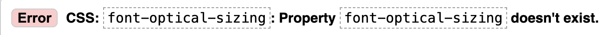
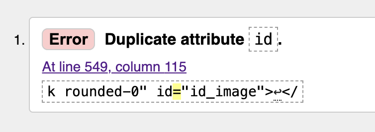
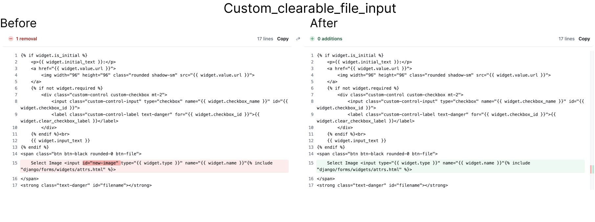
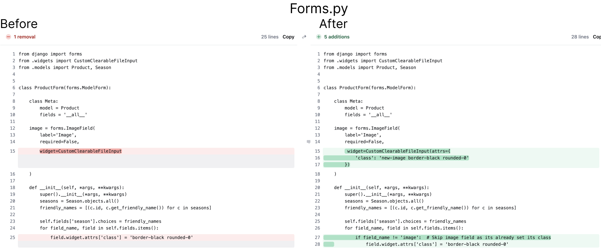
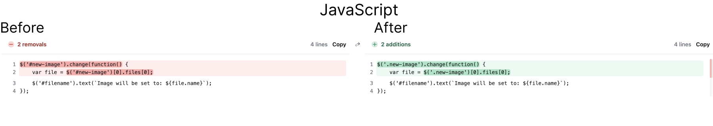

# BOTANIC LABS TESTING

Back to [README.md](README.md).

## Contents
1. [Automated Testing](#10-automated-testing)
   - [HTML Validation](#html-validation)
   - [CSS Validation](#css-validation)
   - [JSHint](#jshint)
   - [Python Linter Test](#python-linter-test)
   - [Lighthouse Analysis](#lighthouse-analysis)
2. [Manual Testing](#20-manual-testing)
   - [General Feature Testing](#general-feature-testing)
   - [Home Page](#home-page)
   - [Products Page](#products-page)
   - [Products Detail Page](#products-detail-page)
   - [Shopping Bag](#shopping-bag)
   - [Checkout](#checkout)
   - [User Account](#user-account)
   - [Articles](#articles)
   - [FAQ](#faq)
   - [Errors](#errors)
   - [Toast Notifications](#toast-notifications)
   - [Authentication Permissions](#authentication-permissions)
3. [Browser Compatibility](#browser-compatibility)
4. [Responsiveness Test](#responsiveness-test)
5. [Bugs](#bugs)
   - [Duplicate ID in custom_clearable_file_input](#duplicate-id-in-custom_clearable_file_input)
   - [User Profile Not Attached to Orders in Webhook Handling](#user-profile-not-attached-to-orders-in-webhook-handling)
   - [AttributeError When Using .split() on a NoneType Object in Product Recommendations](#attributeerror-when-using-split-on-a-nonetype-object-in-product-recommendations)
   - [Issue with Form Submission Using CKEditor](#issue-with-form-submission-using-ckeditor)
   - [500 Error Page Logo and Favicon Not Loading](#bug-report-500-error-page-logo-and-favicon-not-loading)

# 1.0 AUTOMATED TESTING
Automated testing was undertaken using a range of open-source developer tools including Google Lighthouse Analysis, HTML, CSS and JavaScript validation. These tests assessed the applications quality, performance, accessibility and adherence to web standards. Any identified issues were addressed to enhance the websites usability and overall user experience.

## HTML Validation
To test the markup validity [HTML Validator](https://validator.w3.org/) was used to assess markup validity and compliance with accessibility standards. THe following table shows the results for each page:

**Summary Table**
| Page             | Date       | Comments | Pass/Fail |
|------------------|------------|----------|-----------|
| Home             |    16/10/24        |          |    Pass       |
| Products         |    16/10/24       |          |     Pass      |
| Product Detail   |    16/10/24       |          |    Pass       |
| Add Product      |     18/10/24       |   Duplicate id - [Go to Duplicate ID Issue](#duplicate-id-in-custom_clearable_file_input)       |    Pass       |
| Edit Product     |     19/10/24       |   Add alt tag to img element.       |    Pass       |
| Bag              |   17/10/24         |          |    Pass       |
| Checkout         |    17/10/24        |          |    Pass       |
| Checkout Success |     17/10/24       |          |    Pass       |
| Profile          |     17/10/24       |          |    Pass       |
| Articles         |     17/10/24       |          |    Pass       |
| Article Detail   |   19/10/24         |   The above error was recorded multiple times throughout the content block rendered by summernote. It seems the HTML validator does not recognise the CSS property 'font-optical-sizing'. Having checked the website across multiple browsers and screen sizes it is working correctly therefore this particularly error has been ignored. In the future I will experimenth with other WYSIWYG text editors.        |     Pass      |
| Add Article      |  19/10/24        | During HTML validation, several warnings and errors were encountered due to the implementation of the Summernote widget. These errors mainly include: Use of obsolete attributes like frameborder on iframe. Attributes such as maxlength, cols, rows, height, and width being incorrectly applied to 
 elements and invalid properties such as font-optical-sizing.Despite these validation warnings, they do not affect the functionality or performance of the website. Summernote’s rendering works as expected, and these validation issues are related to how Summernote generates its HTML structure, which is beyond the control of the project code. Given that Summernote is a widely used and maintained WYSIWYG editor, these warnings are safe to ignore. |           |
| Edit Article     |    19/10/24        |   As "Add Article"       |           |
| FAQ              |     19/10/24       |   As "Add Article"       |           |
| Add FAQ          |    19/10/24        |   As "Add Article"       |           |
| Edit FAQ         |     19/10/24       |   As "Add Article"       |           |
| Login            |   17/10/24         |          |    Pass       |
| Register         |   17/10/24         |          |    Pass       |
| Logout           |   17/10/24         |          |    Pass       |
| Password Reset   |   17/10/24         |          |    Pass       |
| 404 Error        |   17/10/24         |          |    Pass       |

## CSS Validation

The CSS code of the website was validated using the [W3C CSS Validator](https://jigsaw.w3.org/css-validator/#validate_by_input). The validation results are as follows:

| CSS File      | Errors | Warnings                                                                                                                                       | Comments                                                                                                                        | Testing Date   |
|---------------|--------|------------------------------------------------------------------------------------------------------------------------------------------------|---------------------------------------------------------------------------------------------------------------------------------|----------------|
| articles.css  | None   | -webkit-box is a vendor extension -webkit-line-clamp is a vendor extension -webkit-box-orient is a vendor extension                      | These warnings relate to non-standard CSS properties for Webkit browsers. They can be safely ignored since they ensure compatibility with browsers like Chrome and Safari. Fallbacks have been provided for browsers that do not support Webkit. | 06 October 2024 |
| stripe.css    | None   | -webkit-transition is a vendor extension                                                                                                       | This warning is related to the use of the non-standard CSS transition property for Webkit-based browsers. It can be ignored as it's necessary for smooth animation in browsers like Chrome and Safari. | 06 October 2024 |
| faq.css       | None   | None                                                                                                                                           | No errors or warnings present.                                                                                                  | 06 October 2024 |
| products.css  | None   | None                                                                                                                                           | No errors or warnings present.                                                                                                  | 06 October 2024 |
| profile.css   | None   | None                                                                                                                                           | No errors or warnings present.                                                                                                  | 06 October 2024 |
| base.css      | None   | -webkit-user-select is a vendor extension -moz-user-select is a vendor extension -ms-user-select is a vendor extension                   | These warnings refer to vendor-specific CSS extensions used to control text selection behaviour across different browsers. These properties can be safely ignored as they ensure consistent behaviour in Webkit, Firefox, and IE/Edge browsers. | 06 October 2024 |

## JSHint
The JavaScript code was validated using [JSHint](https://jshint.com/). The results of the validation are as follows:

| Page               | Results                      | Comment                                                                                                                                                                              | Pass/Fail |
|--------------------|------------------------------|--------------------------------------------------------------------------------------------------------------------------------------------------------------------------------------|-----------|
| checkout          | No errors or warnings         | There are 5 functions in this file. The function with the largest signature takes 1 argument, while the median is 1. Largest function has 13 statements, median is 5. The most complex function has a cyclomatic complexity value of 3, while the median is 2. | Pass      |
| Profile    | No errors or warnings         | There is only one function in this file. It takes no arguments. This function contains 4 statements. Cyclomatic complexity number for this function is 2.                                                             | Pass      |
| add_Article        | No errors or warnings         | There is only one function in this file. It takes no arguments. This function contains 2 statements. Cyclomatic complexity number for this function is 1.                                                             | Pass      |
| edit_article       | No errors or warnings         | There is only one function in this file. It takes no arguments. This function contains 2 statements. Cyclomatic complexity number for this function is 1.                                                             | Pass      |
| bag                | No errors or warnings         | There are 3 functions in this file. The function with the largest signature takes 1 argument, while the median is 1. Largest function has 5 statements, median is 2. The most complex function has a cyclomatic complexity value of 1, while the median is 1. | Pass      |
| add_product        | No errors or warnings         | There is only one function in this file. It takes no arguments. This function contains 2 statements. Cyclomatic complexity number for this function is 1.                                                             | Pass      |
| edit_product       | No errors or warnings         | There is only one function in this file. It takes no arguments. This function contains 2 statements. Cyclomatic complexity number for this function is 1.                                                             | Pass      |
| products           | No errors or warnings         | There are 2 functions in this file. The function with the largest signature takes 1 argument, while the median is 0.5. Largest function has 12 statements, median is 6.5. The most complex function has a cyclomatic complexity value of 2, while the median is 1.5. | Pass      |

**N.B.** A number of the JavaScript files were identified as having undefined variables, typically related to jQuery’s $ and stripe. This occurs because they are from external libraries that JSHint does not recognise. These are not actual errors in the code, but warnings from JSHint, as it does not have knowledge of the external libraries.  

## Python Linter Test
Python files that were created or edited for this project were validated using [CI Python Linter](https://pep8ci.herokuapp.com/). Any identied issues were rectified. Gitpod also has a built-in Python Linter which can be accessed by using the command `python3 -m flake8`.

All code edited and created for this project has passed the Python Linter validation tests. 

## Lighthouse Analysis
For this project, Google’s Lighthouse tool was primarily used as a diagnostic aid to identify areas for improvement, rather than as a score-driven objective. Lighthouse is designed to highlight key areas like performance, accessibility, and best practices, but it’s important to understand that its score is not a definitive measure of a website’s overall quality. While it offers valuable suggestions, focusing solely on achieving a perfect score can lead to misguided priorities that may not align with the specific goals of the project.

Key issues identified by Lighthouse were addressed, such as optimising image sizes and improving accessibility where feasible. However, the emphasis was on balancing practical performance enhancements with the real-world needs of the site’s users and functionality. The objective was not to chase perfect scores, but to ensure that the website is efficient, user-friendly, and meets essential accessibility standards.

Render-Blocking Resources:
In the performance review, Lighthouse flagged several third-party resources, such as Bootstrap, jQuery, and Google Fonts, as render-blocking elements that could potentially slow down the initial page load. These resources are essential for the core functionality and visual presentation of the website, and since they come from third-party CDNs, I do not have control over their optimisation. While these render-blocking issues were noted, removing or deferring them could compromise the site’s user experience and functionality. Given their importance, no action was taken to eliminate these resources as they are critical for the proper rendering and interactivity of the site.

| Page              | Performance |          | Accessibility |          | Best Practice |          | SEO  |          |
|-------------------|-------------|----------|---------------|----------|---------------|----------|------|----------|
|                   | Mobile (%)  | Desktop (%) | Mobile (%)    | Desktop (%) | Mobile (%)    | Desktop (%) | Mobile (%) | Desktop (%) |
| **Home**          | 72          | 96       | 100             | 100       | 100           | 96      | 100  | 100      |
| **Products**     | 78          | 95       | 96            | 96       | 100           | 100      |91  | 91      |
| **Articles**        | 78          | 94       | 100            | 100       | 100           | 100      | 100  | 100      |
| **Article**        | 80          | 93       | 95            | 95       | 100           | 100      | 100  | 100      |
| **Article Management**      | 79          | 88       | 95            | 95       | 100           | 100      | 100  | 100      |
| **Edit Article**       | 78          | 81       | 88            | 90       | 100           | 100      | 100  | 100      |
| **Faq**        | 77          | 94       | 100            | 100       | 100           | 100       | 100  | 100      |
| **New Faq**   | 74          | 81    | 95             | 95        | 96            | 100      | 100  | 100      |
| **Edit Faq**       | 81          | 84       | 96            | 96       | 100           | 100      | 100  | 100      |
| **Profile**| 74          | 75       | 94           | 94      | 100           | 100      | 100  | 100      |
| **Profile**| 74          | 75       | 94           | 94      | 100           | 100      | 100  | 100      |
| **Add Product**| 76          | 89       | 95          | 95      | 100           | 100      | 100  | 100      |
| **Edit Product**| 78          | 87       | 92          | 92      | 96           | 96      | 100  | 100      |
| **Bag**| 81          | 88       | 100          | 100      | 100           | 100      | 91  | 91     |
| **checkout**| 74          | 98       | 89          | 89      | 81           | 100      | 100  | 100     |
| **Confirmation**| 70          | 94       | 93          | 93      | 100           | 100      | 100  | 100     |
| **Logout**| 85          | 96       | 95          | 95      | 100           | 100      | 90  | 90     |
| **Register**| 83          | 96       | 91          | 91      | 100           | 100      | 90  | 90     |
| **Log in**| 84          | 96       | 91          | 91      | 100           | 100      | 90  | 90     |
| **404**| 85          | 96       | 95          | 95      | 96           | 96      | 90  | 100     |

# 2.0 MANUAL TESTING
## Feature Testing:
For each feature the expected outcomes and actual outcomes are clearly defined for each feature, making it easy to assess whether the application meets the requirements. This process makes it easier to identify and address any issues or discrepancies that may arise and also serves as a reference point for other developers to understand the expected behaviour of a feature. The results are recorded in the following tables:

  
General Feature Testing

| Feature                   | Expected Outcome                                                             | Testing Procedure                                                       | Actual Outcome                                                                                      |
|---------------------------|------------------------------------------------------------------------------|-------------------------------------------------------------------------|------------------------------------------------------------------------------------------------------|
| Responsive Design          | Website displays correctly across all devices and screen sizes               | Test on various devices and screen sizes                                | The website was responsive and usable on all tested devices.                                         |
| Navigation                 | All navigation links function, and dropdowns are operational                 | Test each navigation link and dropdown menu                             | Navigation was smooth, and all links/buttons worked as expected.                                     |
| Navbar - sticky            | Navbar remains visible at the top when scrolling                             | Scroll down the page and confirm the navbar stays at the top            | The navbar remained sticky and visible at the top of the page when scrolling.                        |
| Navbar - logo              | Logo functions as a link to the homepage                                     | Navigate away from the homepage, click the logo, and confirm it redirects to the homepage | Clicking the brand logo redirected to the homepage as expected.                                      |
| Navbar - Responsiveness    | Navbar links collapse into a hamburger menu on smaller devices               | Test on a mobile device to ensure the navbar collapses and all links are functional | The navbar collapsed as expected, and all links worked correctly on smaller devices.                 |
| Navbar - logged out        | Shows 'Register' and 'Sign In' links in account dropdown                     | Log out and check the account dropdown menu for 'Register' and 'Sign In' | The 'Register' and 'Sign In' links appeared correctly for logged-out users.                          |
| Navbar - logged in (non-admin) | Shows 'My Account' and 'Sign Out' links in account dropdown                | Log in as a non-admin user and check the account dropdown for 'My Profile' and 'Sign Out' | The 'My Profile' and 'Sign Out' links appeared correctly for logged-in non-admin users.              |
| Navbar - logged in (admin)    | Shows 'Product Management', 'Article Management', 'My Profile' and 'Sign Out' links in account dropdown | Log in as an admin and confirm 'Site Management', 'My Profile', and 'Sign Out' are available | The admin-specific links were displayed correctly in the navbar for the admin user.                  |
| Navbar - bag (empty)       | Bag icon appears black with £0 when bag is empty                            | Check the navbar when the bag is empty                                  | The bag icon appeared black with £0, indicating an empty bag as expected.                           |
| Navbar - bag (contents)    | Bag icon appears blue and shows the correct total when items are added      | Add items to the bag and check the navbar                               | The bag icon appeared blue, showing the correct total after items were added.                       |
| Navbar - search box (no contents) | Submits search and redirects to products page with a message if no search term is entered | Click on the search icon with an empty search box                       | The search box redirected to the products page and displayed an error message when no search term was entered. |
| Navbar - search box (contents)    | Submits search and redirects to products page with results; displays search term on page | Enter a search term, click the search icon, and check the results and displayed term | The search returned relevant results and displayed the search term on the products page.             |
| Navbar - search box dropdown | On medium or smaller screens, the search icon reveals a dropdown search bar | Use dev tools to simulate a medium or small screen, click the search icon, enter a search term, and submit | The search box dropdown appeared on smaller screens, and the search functionality worked as expected. |
| Search Functionality       | Provides relevant results when searching                                     | Use various queries in the search bar                                   | The search returned relevant results for all test queries.                                           |
| Delivery Banner            | Shows delivery banner with correct text and amount                           | Verify the text and amount on the delivery banner                       | The delivery banner showed the correct amount and free delivery threshold.                           |
| Favicon                    | Displays favicon in the browser tab                                          | Confirm the favicon appears in the browser tab                          | The favicon appeared correctly in the browser tab.                                                   |
| Footer                     | All footer links are functional                                              | Test each link in the footer                                            | All footer links were functional and led to the correct pages.                                       |
| Footer - contents          | Displays social links, informational links, 'About Us' text, disclaimer, and personal links | Review footer content for completeness                                 | The footer displayed all expected content, including social and informational links.                  |
| Footer - responsive        | Stacks content on smaller screens and adjusts margins appropriately          | Simulate various screen sizes with dev tools                            | The footer stacked correctly and margins adjusted as expected on smaller screens.                    |
| Footer - Hover on links    | Shows hover effect with smooth transition on links                           | Hover over each link in the footer                                      | Hover effect worked smoothly across all links in the footer.                                         |
| Footer - social            | Opens social media links in a new tab                                        | Click each social link and confirm they open in a new tab               | All social media links opened in new tabs as expected.                                               |
| Footer - More Info links   | Directs to the correct pages                                                 | Click on 'More Info' links and confirm they lead to the correct pages   | All 'More Info' links directed to the correct pages.                                                 |

  
Home page

| Feature            | Expected Outcome                       | Testing Procedure             | Actual Outcome                                                                                    |
|--------------------|----------------------------------------|-------------------------------|--------------------------------------------------------------------------------------------------|
| Hero Section       | Displays image and CTA button          | Verify hero section content   | The hero section displayed the image and CTA button correctly as expected.                        |
| Season Categories  | Links to correct product pages         | Test each season category link| Each season category link directed to the correct product page as expected.                       |
| Shop Now Button    | Takes user to the products page, displaying all products   | Click on "Shop Now" button and check that all products are displayed | The "Shop Now" button correctly directed to the products page and displayed all products.          |
| All Seasons Button | Takes user to the products page, displaying all products   | Click on "All Seasons" button and check that all products are displayed | The "All Seasons" button directed to the products page and displayed all products as expected.     |

  
Products page

  
  | Feature                 | Expected Outcome                                    | Testing Procedure                    | Actual Outcome                                                                                    |
|-------------------------|-----------------------------------------------------|--------------------------------------|--------------------------------------------------------------------------------------------------|
| Product Listing          | All products displayed correctly                    | Verify product cards and information | All product cards and information displayed correctly as expected.                                |
| Sorting                  | Products sort correctly                             | Test all sorting options             | All sorting options worked as expected, sorting the products correctly.                           |
| Filtering                | Products filter by season                           | Test season filtering                | Season filtering worked correctly, displaying products matching the selected season.              |
| Product Cards            | Link to correct product pages                       | Click on various product cards       | Product cards linked to the correct product detail pages as expected.                             |
| Delete Button (admin only)   | Opens confirmation modal, deletes product if confirmed | For superusers, click delete and confirm in modal | The delete button opened the confirmation modal and successfully deleted the product when confirmed. |
| Edit Button  (admin only)    | Takes user to the edit product page                 | For superusers, click edit and verify redirection | The edit button redirected to the edit product page correctly as expected.                        |​

  
Products detail page

  
  | Feature             | Expected Outcome                               | Testing Procedure                       | Actual Outcome                                                                                 |
|---------------------|------------------------------------------------|-----------------------------------------|------------------------------------------------------------------------------------------------|
| Product Information | All details are correct                        | Verify product information              | Product information displayed correctly, including all necessary details.                       |
| Image               | Full-size view functions                       | Test image enlargement feature          | Image enlargement feature worked as expected, showing the full-size image on click.             |
| Quantity Selector   | Increments/decrements correctly                | Test quantity selection                 | The quantity selector incremented and decremented the product quantity as expected.             |
| Add to Bag Button   | Adds product to bag                            | Test adding products to bag             | The product was added to the bag successfully when the button was clicked.                      |
| Toast Notification  | Shows success message with bag summary when product added to bag | Add product and check toast           | Toast notification appeared correctly with a success message and updated bag summary.           |
| Recommendations     | Displays related products                      | Verify recommended products             | Related products were displayed as expected in the recommendation section.                      |
| Keep Shopping Button | Returns user to the all products page         | Click the button and verify redirection | Keep Shopping button redirected the user back to the all products page correctly.               |
| Edit Button (admin only)        | Takes superuser to the edit product page       | For superusers, click edit and verify redirection | Edit button redirected superuser to the edit product page as expected.                           |
| Delete Button (admin only)      | Opens confirmation modal, deletes product if confirmed | For superusers, click delete and confirm in modal | Confirmation modal opened, and product was successfully deleted upon confirmation.              |​

  
Shopping bag

  
  | Feature            | Expected Outcome                               | Testing Procedure                    | Actual Outcome                                                                                  |
|--------------------|------------------------------------------------|--------------------------------------|-------------------------------------------------------------------------------------------------|
| increase/decrease Quantity    | Updates product quantities                     | Modify quantities in bag             | Product quantities successfully updated as expected.                                             |
| Remove Item        | Removes items from bag                         | Remove items from bag                | Items were successfully removed from the bag when clicked.                                       |
| Update button    | Updates the product quantities                     | Modify quantities in bag             | The quantities were updated correctly after using the update button.                             |
| Delivery Threshold | Applies free delivery over threshold           | Test with orders above/below threshold | Free delivery applied as expected when the order total exceeded the threshold.                   |
| Toast Notifications| Shows correct messages for add/update/remove actions | Verify toasts for add/update/remove | Toast notifications displayed appropriate messages for add, update, and remove actions.          |
| Update Button      | Updates the shopping cart totals               | Change quantities, click update, and verify totals | The cart totals updated successfully after modifying quantities and clicking the update button. |
| Secure Checkout Button | Takes user to the checkout page            | Click the button and verify redirection to checkout | The secure checkout button redirected the user to the checkout page without issues.              |
| Keep Shopping Button | Returns user to the all products page        | Click the button and verify redirection | Keep shopping button redirected back to the all products page as expected.                       |​

  
Checkout

  
  | Feature            | Expected Outcome                                  | Testing Procedure                   | Actual Outcome                                                                                   |
|--------------------|---------------------------------------------------|-------------------------------------|--------------------------------------------------------------------------------------------------|
| Checkout Form      | All fields function correctly, any saved information correctly displayed                     | Test all form fields                | All form fields functioned correctly, and saved information was displayed as expected.            |
| Save Info          | Saves info for logged-in users                    | Test saving delivery information    | Delivery information was saved for logged-in users without issues.                               |
| Payment Processing | Processes payments correctly                      | Test with Stripe test cards         | Payment processing worked correctly with Stripe test cards.                                       |
| Order Confirmation | Displays correct order details                    | Verify order confirmation page      | The order confirmation page displayed all details correctly after purchase.                      |
| Confirmation Email | Sends email with correct info                     | Check email after order             | Confirmation email was received with the correct order details.                                   |
| Toast Notification | Shows success message                             | Verify toast after successful order | Toast notification appeared with the success message after completing the order.                  |
| Complete Order Button | Completes the order and displays confirmation  | Click button, verify order completion and confirmation | The order was successfully completed, and the confirmation page displayed as expected.           |
| Adjust Bag Button  | Returns user to their shopping bag                | Click button and verify redirection to bag | The button redirected back to the shopping bag page without any issues.                         |​

  
User Account

  | Feature            | Expected Outcome                            | Testing Procedure                    | Actual Outcome                                                                                   |
|--------------------|---------------------------------------------|--------------------------------------|--------------------------------------------------------------------------------------------------|
| Registration       | Creates new account                         | Test registration process            | New accounts were successfully created via the registration form.                                |
| Email Verification | Sends and processes verification            | Verify email and confirmation process| Verification emails were received and processed correctly.                                        |
| Login              | Logs in user correctly                      | Test with correct/incorrect credentials | Users were able to log in successfully with correct credentials; incorrect credentials showed error messages. |
| Logout             | Logs out user correctly                     | Test logout process                  | Users were logged out successfully, and redirected to the home page as expected.                 |
| Profile            | Updates personal information                | Test updating profile info           | Profile information was updated successfully in the profile section.                             |
| Order History      | Displays correct orders                     | Verify order history in profile      | Order history was displayed correctly in the user profile.                                        |
| Password Reset     | Resets password successfully                | Test password reset process          | The password reset process worked as expected, with password reset emails sent and confirmed.     |​

  
Articles

  
| Feature          | Expected Outcome                            | Testing Procedure                | Actual Outcome                                                                                   |
|------------------|---------------------------------------------|----------------------------------|--------------------------------------------------------------------------------------------------|
| Article Listing  | Displays all published articles             | Verify article list page         | All published articles were displayed correctly on the articles list page.                       |
| Article Detail   | Shows correct article content               | Test individual article pages    | Individual articles displayed their correct content and format.                                  |
| Admin Controls   | Add/Edit/Delete for superusers              | Test admin article management    | Admin users were able to add, edit, and delete articles as expected.                             |
| Toast Notifications | Shows correct messages                    | Verify toasts for article actions | Correct toast notifications were displayed for adding, editing, and deleting articles.           |​

  
FAQ

  
  ## FAQ

| Feature           | Expected Outcome                           | Testing Procedure                | Actual Outcome                                                                                   |
|-------------------|--------------------------------------------|----------------------------------|--------------------------------------------------------------------------------------------------|
| FAQ Listing       | Displays all FAQs                          | Verify FAQ page content          | All FAQs were displayed correctly on the FAQ page.                                                |
| FAQ Accordion     | Expands/collapses answers                  | Test FAQ interaction             | FAQ answers expanded and collapsed smoothly as expected.                                          |
| Admin Controls    | Add/Edit/Delete for superusers             | Test admin FAQ management        | Admin users were able to add, edit, and delete FAQs successfully.                                 |
| Toast Notifications | Shows correct messages                   | Verify toasts for FAQ actions    | Correct toast notifications were displayed for FAQ-related actions like adding, editing, and deleting. |​

  
Errors

| Feature           | Expected Outcome                            | Testing Procedure                | Actual Outcome                                                                                       |
|-------------------|---------------------------------------------|----------------------------------|------------------------------------------------------------------------------------------------------|
| 404 Page          | Displays for non-existent URLs              | Test with invalid URL            | 404 error page displayed as expected when accessing non-existent URLs.                               |
| 500 Page          | Displays for server errors                  | Intentionally cause server error | The 500 error page was triggered successfully by adding a divide-by-zero error in the products view, and displayed as expected when navigating to the products page |

  
Toast Notifications

  | Feature               | Expected Outcome                             | Testing Procedure                     | Actual Outcome                                                                                      |
|-----------------------|----------------------------------------------|---------------------------------------|-----------------------------------------------------------------------------------------------------|
| Add to Bag            | Shows success with bag summary               | Add product to bag                    | Bag updated successfully, toast message displayed with correct bag summary.                         |
| Update Bag            | Shows success without bag summary            | Update bag quantities                 | Bag updated successfully, toast message displayed without the bag summary.                          |
| Remove from Bag       | Shows success without bag summary            | Remove item from bag                  | Item removed successfully, toast message displayed without the bag summary.                         |
| Checkout Success      | Shows order confirmation                     | Complete checkout process             | Order placed successfully, confirmation page and email displayed as expected.                       |
| User Registration     | Shows welcome message                        | Register new user                     | User registered successfully, welcome message displayed.                                             |
| User Login            | Shows welcome back message                   | Log in as user                        | User logged in successfully, welcome back message displayed.                                         |
| User Logout           | Shows logout confirmation                    | Log out as user                       | User logged out successfully, confirmation message displayed.                                        |
| Profile Update        | Shows success message                        | Update user profile                   | Profile updated successfully, success message displayed.                                             |
| Admin Product Actions | Shows appropriate messages                   | Perform admin product actions         | Product added, edited, and deleted successfully with appropriate success and error messages displayed. |
| Admin Article Actions | Shows appropriate messages                   | Perform admin article actions         | Articles added, edited, and deleted successfully with appropriate messages.                          |
| Admin FAQ Actions     | Shows appropriate messages                   | Perform admin FAQ actions             | FAQ added, edited, and deleted successfully with appropriate messages.                               |

  
Authenication Permissions

1. **Access Pages as an Unauthenticated User**

| Feature                                      | Test Procedure                                                                 | Expected Outcome                                                                          | Actual Outcome           |
|----------------------------------------------|--------------------------------------------------------------------------------|------------------------------------------------------------------------------------------|--------------------------|
| Access Add Product page as unauthenticated user | Attempt to access `/products/add/` without logging in                           | Redirected to login page with message: "Please log in to access this feature."            | Worked as expected       |
| Access Add Article page as unauthenticated user | Attempt to access `/articles/add/` without logging in                           | Redirected to login page with message: "Please log in to access this feature."            | Worked as expected       |
| Access Admin Articles page as unauthenticated user | Attempt to access `/admin_articles/` without logging in                         | Redirected to login page with message: "Please log in to access this feature."            | Worked as expected       |
| Access Edit FAQ page as unauthenticated user | Attempt to access `/faq/edit/<id>` without logging in                           | Redirected to login page with message: "Please log in to access this feature."            | Worked as expected       |
| Delete FAQ as unauthenticated user           | Attempt to access `/faq/delete/<id>` without logging in                         | Redirected to login page with message: "Please log in to access this feature."            | Worked as expected       |
| Access Edit Product page as unauthenticated user | Attempt to access `/products/edit/<id>` without logging in                      | Redirected to login page with message: "Please log in to access this feature."            | Worked as expected       |

2. **Access Pages as an Authenticated Non-Superuser**

| Feature                                      | Test Procedure                                                                 | Expected Outcome                                                                          | Actual Outcome           |
|----------------------------------------------|--------------------------------------------------------------------------------|------------------------------------------------------------------------------------------|--------------------------|
| Access Add Product page as non-superuser     | Log in as a regular user and attempt to access `/products/add/`                  | Redirected to home page with message: "Sorry, only store owners can do that."             | Worked as expected       |
| Access Add Article page as non-superuser     | Log in as a regular user and attempt to access `/articles/add/`                  | Redirected to home page with message: "Sorry, only store owners can do that."             | Worked as expected       |
| Access Admin Articles page as non-superuser  | Log in as a regular user and attempt to access `/admin_articles/`                | Redirected to home page with message: "Sorry, only store owners can do that."             | Worked as expected       |
| Access Edit FAQ page as non-superuser        | Log in as a regular user and attempt to access `/faq/edit/<id>`                  | Redirected to home page with message: "Sorry, only store owners can do that."             | Worked as expected       |
| Delete FAQ as non-superuser                  | Log in as a regular user and attempt to delete an FAQ at `/faq/delete/<id>`      | Redirected to home page with message: "Sorry, only store owners can do that."             | Worked as expected       |
| Access Edit Product page as non-superuser    | Log in as a regular user and attempt to access `/products/edit/<id>`             | Redirected to home page with message: "Sorry, only store owners can do that."             | Worked as expected       |

3. **Access Pages as a Superuser**

| Feature                                      | Test Procedure                                                                 | Expected Outcome                                                                          | Actual Outcome           |
|----------------------------------------------|--------------------------------------------------------------------------------|------------------------------------------------------------------------------------------|--------------------------|
| Access Add Product page as superuser         | Log in as a superuser and attempt to access `/products/add/`                     | Able to access the page and add a product successfully                                   | Worked as expected       |
| Access Add Article page as superuser         | Log in as a superuser and attempt to access `/articles/add/`                     | Able to access the page and add an article successfully                                  | Worked as expected       |
| Access Admin Articles page as superuser      | Log in as a superuser and attempt to access `/admin_articles/`                   | Able to access the admin articles page successfully                                      | Worked as expected       |
| Access Edit FAQ page as superuser            | Log in as a superuser and attempt to access `/faq/edit/<id>`                     | Able to edit the FAQ successfully                                                        | Worked as expected       |
| Delete FAQ as superuser                      | Log in as a superuser and attempt to delete an FAQ at `/faq/delete/<id>`         | Able to delete the FAQ successfully                                                      | Worked as expected       |
| Access Edit Product page as superuser        | Log in as a superuser and attempt to access `/products/edit/<id>`                | Able to edit the product successfully                                                    | Worked as expected       |

## Browser Compatibility 
-   Expected: Consistent appearance and functionality across major browsers.
-   Testing: Test site on Chrome, Mozilla, Safari, and Edge browsers.
-   Outcome: The site renders as expected with good responsiveness and compatibility across different browsers.

## Responsiveness Test
- Expected: Site should render appropriately on various devices with different screen sizes. 
- Testing: Test responsiveness on iPhone 12, iPad 12, and desktop (1024px). 
- Outcome: The site displays responsively across different devices, maintaining functionality and appearance as intended.

# BUGS (RESOLVED)
### Duplicate ID in custom_clearable_file_input

Issue:
When adding a product via the custom_clearable_file_input widget, an error was being raised due to the use of duplicate id attributes in the HTML. The first id was explicitly set in my form template and used by JavaScript to display the selected filename. The second id was automatically generated by the  tag, causing a conflict by introducing a second identical id on the page.

This violated HTML standards, as multiple elements cannot share the same id, and raised the following error during HTML validation:

Solution:
To resolve this issue:

	1. Remove the id attribute from the custom widget. 

    2. 
    A. Add a class="new-image" to the input field for file selection in the forms.py. This is achieved by using the attrs attribute to pass a custom HTML attributes to CustomClearableFileInput.in the attrs dictionary the class attribute is set to include "new-image border-black rounded-0". the new-image class can be targetted with JavaScript for functionality.
    B. A condition has been set to skip adding additional classes to the image. This is done by checking if the current field being iterated over is the image field. If it is, the field.widget.attrs['class'] is not modified because the class attribute has alerady been assigned when defining CustomClearableFileInput. Without this condition check the class for CustomClearableFileInput is overwritten and it will not function correctly. 

	3.	The JavaScript was modified to reference this class ($('.new-image')) instead of the id to update the displayed filename dynamically.
	

Outcome:
After making these changes, the form works as expected. Users can now upload images without errors, and the filename updates dynamically as intended. The code passes HTML validation since no duplicate IDs are present.

**User Profile Not Attached to Orders in Webhook Handling**

Issue: When capturing a payment via Stripe webhooks (e.g., by commenting out the form submission process to simulate a user closing the page before submission), the user_profile was not being attached to the order, even though the payment was successfully processed. The issue was caused by placing user_profile=profile in the wrong location within the webhook handler code.

Solution: The user_profile assignment was mistakenly placed within the section of the code that verifies if an order already exists, rather than in the section where a new order is created. Moving user_profile=profile to the correct location in the code, where the new order is created, ensured that user profiles are correctly attached to new orders processed through the webhook.

Outcome: After correcting the code placement, the user_profile is now correctly attached to orders, whether processed via the form submission or handled directly through Stripe webhooks. This allows user order history and profile data to function as expected in both cases.

## AttributeError When Using .split() on a NoneType Object in Product Recommendations
Issue: An error occurred when adding new products due to an attempt to call the .split() method on a NoneType object while processing the recommendations field in the Product model.

Cause: The issue arose because the recommendations field was initially a CharField that could be left empty. When the field was empty, it was stored as None, and trying to call .split() on a NoneType value resulted in an error. The database was originally set up to allow admin users to enter recommendations as a string using product primary key (PK) numbers, with products separated by commas.

Solution: The Product model was refactored to improve usability by allowing admin users to select specific product recommendations instead of manually entering comma-separated strings. The recommendations field was replaced with three separate ForeignKey fields to allow relational selection of recommended products:

## Issue with Form Submission Using CKEditor
Issue: After implementing CKEditor, the form was not submitting correctly when all required fields were filled, leading to form validation issues.

Cause: The issue stemmed from CKEditor not properly updating the content of the hidden textarea field when submitting the form. As a result, the form's content field appeared empty, causing validation errors.

Solution: The issue was resolved by switching to Summernote, a different rich text editor that integrates better with Django forms, preventing the submission issues encountered with CKEditor.

## Bug Report: 500 Error Page Logo and Favicon Not Loading

Issue: During testing of the 500 error page, both the site logo and the favicon were returning 404 errors and not displaying correctly. The issue occurred because the page was searching for these files in the wrong location, specifically within the “products” directory, which caused the paths to the files to be incorrect.

Cause: The incorrect file paths for the favicon and logo on the 500 error page were causing the browser to look in a specific directory that did not contain the files, resulting in the 404 error.

Solution:

To resolve this issue:

	1.	Custom Error Handlers: I created custom handlers for both the 404 and 500 error pages. This involved setting up corresponding views for each error type.
	2.	Views and URLs: The views for the 404 and 500 error pages were then referenced and specified in the main urls.py file, ensuring that the custom error templates are properly rendered.
	3.	Relocation of Templates: I moved the 404 and 500 error templates to the correct folder structure: home > templates > home, ensuring that Django could properly locate and render these templates without path conflicts.

Outcome: After making these changes, the 500 error page now displays correctly with the logo and favicon loading without any 404 errors.

Acknowledgment:

Solution inspired by the GitHub repository: The Games Pit
Contributed by GitHub user: HollyT85

# BUGS (UNRESOLVED)
## Bug Report: Order Confirmation Page Accessible After Logout

Issue:
After a user completes a purchase and views the order confirmation page, they can still access the confirmation page after logging out by pasting the URL into the browser. This exposes sensitive data such as the user’s email address, which should no longer be accessible once the user has logged out.

Steps to Reproduce:

	1.	Complete a purchase and reach the order confirmation page.
	2.	Copy the URL.
	3.	Log out of the account.
	4.	Paste the copied URL into the browser.
	5.	The confirmation page, containing the user’s email and order details, is displayed.

Previous Attempts to Resolve:

	1.	User Authentication Check: An initial attempt to fix the bug involved checking if the user is authenticated. However, this still allowed authenticated users who didn’t own the order to access the page.
	2.	Order Ownership Check: Added a check to verify that only the owner of the order could access the confirmation page, but it did not fully resolve the issue.

  Outcome:
  This issue still persists in Botanic Labs and could not be resolved within the scope of this project. It was noted that this issue also exists in Boutique Ado and a number of other student projects.

## Bug Report: Horizontal Scroll on Homepage for Product Seasons
On the homepage, users can select products by season through a horizontally scrollable div. While this works fine on touch devices where users can swipe, those using a mouse with a scroll wheel must hold the “Shift” key to scroll horizontally. This could be unintuitive for some users on desktop and laptop devices.

However, this is not so much of a bug, as everything functions as intended. It’s more of a comment to make users aware of this behaviour. Additionally, this issue will only affect users on large devices who manually reduce the screen size. Otherwise, all the season cards are visible by default, so horizontal scrolling is not required in those cases. For users on smaller devices, the ability to swipe makes this less of a concern.

## Bug Report: Admin Interface Requires Trailing Slash

Issue:
When attempting to access the Django admin interface on the deployed site, users are required to manually add the trailing slash (/admin/). If the slash is omitted (i.e., /admin), the request is caught by the 404 error handler, and the admin page does not load. Users can only access the admin interface if they manually include the trailing slash in the URL.

Cause:
The issue seems to stem from URL handling on the deployed server, where Django does not automatically append the trailing slash when accessing the /admin route. As a result, the server interprets /admin as a different path and triggers the 404 error.

Impact:
This bug primarily affects users attempting to access the admin interface without a trailing slash. While this is a minor inconvenience, it could cause confusion for users unfamiliar with the need for the trailing slash and lead to unnecessary frustration.

Solution:
Currently, users can access the Django admin interface by manually adding the trailing slash (/admin/). However, further investigation is needed to determine if automatic redirection to /admin/ can be implemented to improve the user experience.